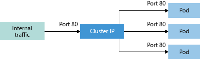
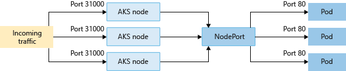
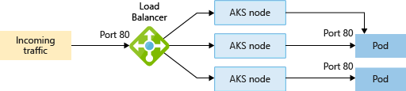

## 설치

### 윈도우
Docker-Desktop 설치 이후 셋팅에서 enable K8s 클릭

### 리눅스 설치
#### kubespray

- 쿠버네티스 클러스터 구성

#### 단일 노드 테스트용 클러스터 minikube 설치

- 쿠버네티스 미니버전
- 단일 노드 클러스터 구성
- 
    ```
    curl -Lo minikube https://storage.googleapis.com/minikube/releases/latest/minikube-linux-amd64 \
  && chmod +x minikube

  sudo mkdir -p /usr/local/bin/
  sudo install minikube /usr/local/bin/

  minikube start --driver=none

  #에러 1 : Sorry, Kubernetes 1.18.3 requires conntrack to be installed in root's path
  sudo yum install conntrack -y

  #에러 2 : docker 그룹 추가 및 계정 추가
  sudo groupadd docker
  sudo usermod -aG docker $USER && newgrp docker
  ##도커 사용자계정으로 재시작
  
    ```

#### Kubectl 설치

- 쿠버네티스 명령
-
    ```
    curl -LO https://storage.googleapis.com/kubernetes-release/release/`curl -s https://storage.googleapis.com/kubernetes-release/release/stable.txt`/bin/linux/amd64/kubectl

    chmod +x ./kubectl

    sudo mv ./kubectl /usr/local/bin/kubectl

    kubectl version --client


    ```


## 클러스터


- 마스터노드를 Control Plane이라고 부르는것 같음 
- 쿠버네티스는 최소 한개의 마스터노드와 한개의 워커노드를 가진다.

### 마스터용 컴포넌트

클러스터 전체를 관리

#### etcd

- 고가용성( 오랜 기간 동안 지속적으로 정상 운영이 가능한 성질 ) `키값 저장소`
- 쿠버네티스 모든 데이터 저장하는 데이터 베이스 역할
- 서버 하나당 프로세스 한개 사용 -> 안전성 향상
- 안전을 위해 etcd 백업 필수

#### kube-apiserver

- 클러스터의 API를 사용할 수 있도록 하는 컴포넌트
- 인증,인가하여 API 사용
- 쿠버네티스 요청을 apiserber을 통해 다른 컴포터넌트 전달
- 수평적으로 확장, 서버 여러 대에 여러개 사용

#### kube-scheduler

- 클러스터 안에서 자원 할당 가능한 노드 선택하여 파드 실행
- 파드 실행시 조건입력 -> 스케쥴러가 조건에 맞는 노드 선택
- 실행조건
  - 하드웨어
  - Affinity(친밀) : 같이 실행해야하는 파드 한 노드에 실행
  - Anti-Affinity : 다양한 노드로 분산해서 실행
  - 특정 노드에 할당

#### kube-controller-manager

- 컨트롤러 각각을 실행하는 컴포넌트
  - 컨트롤러 : 파드 관리
- 클러스터 안에서 새로운 컨트롤러 사용할 때는 컨트롤러에 해당하는 구조체를 만들고(누가?) kube-controller-manager가 관리하는 큐에 넣어서 실행

#### cloud-controller-manager

- 클라우드 서비스와 연결해 주는 컴포넌트

### 노드용 컴포넌트

#### kubelet

- 클러스터안 모든 노드에서 실행
- 파드의 실행을 직접 관리
- PodSpecs이란느 조건이 담긴 설정을 전달받아 컨테이너 실행하고 정상적으로 실행되는지 헬스체크 진행
- 노드안에 있는 컨테이너라도 쿠버네티스가 직접 만들지 않은 컨테이너는 관리 안함

#### kube-proxy

- 쿠버네티스 클러스타 안에 별도의 가상 네트워크를 설정, 관리

#### 컨테이너 런타임

- 컨테이너 실행시킴
- 도커,containerd,runc

### 애드온

#### 네트워킹 애드온

- kube-proxy 이외에 네트워킹 애드온을 사용

#### DNS 애드온

- 이전은 kube-dns 사용 , 최근엔 CoreDNS가 기본 DNS 애드온

#### 대시보드 애드온

- 웹 UI로 쿠버네티스 사용

#### 컨테이너 자원 모니터링

## 오브젝트 컨트롤러

- 사용자는 템플릿 등으로 쿠버네티스에 바라는 상태(Desired state)를 정의하면 컨트롤러가 바라는 상태와 현재상태가 일치하도록 오브젝트를 생성/삭제

- 오브젝트
  - 파드
  - 서비스
  - 불륨
  - 네임스페이스
    - 네임스페이스는 클러스터 하나를 여러개 논리적 단위로 나눠서 사용
    - kubectl 네임스페이스 지정 `--namespace=kube-system`
    - 기본 목록 ( 명령어 : kubectl get namespaces )
      - default : 기본 네임스페이스, 쿠버네티스 명령 실행시 별도 네임스페이스 없으면 default로 작동
      - kube-system : 쿠버네티스 시스템에서 관리하는 네임스페이스
      - kube-public : 클러스터 안 모든 사용자가 읽을 수 있는 네임스페이스, 보통 클러스터 사용량 같은 정보를 이 네임스페이스에서 관리
      - kube-node-lease : 1.13이후 알파 기능으로 추가, 각 노드의 Lease(리스 , 임대차) Object들을 관리
  - 등

- 컨트롤러
  - 레플리카세트
  - 디플로이먼트
  - 스테이트풀세트
  - 데몬세트
  - 잡
  - 등

### 템플릿
YAML은 Scalars,Sequences,Mappings 형태 기초요소로 표현 주석 #, 형식나눌때 ---
- YAML 예제
```
#Scalars(String/numbers)
Name : Han
Birth : 1990

#Sequences(Arrays/Lists)
ProgrammingSkills:
  -java
  -C
  -python

#Mappings(hashes/dictionaries)
Data:
  Height: 100
  Weight: 80
```
---
- apiVersion : 사용하려는 쿠버네티스 API 버전 명시, kubectl api-versions로 현재 클러스터에서 사용가능한 api버전확인
- kind : 어떤종료 오브젝트 혹은 컨트롤러 작업인지 명시
  - Pod,Deployment,Ingress 등 다양한 오브젝트나 컨트롤러 설정
- metadata : 해당 오브젝트 이름이나 레이블 등을 설정
- spec : 파드가 어떤컨테이너를 갖고 실행하며 어떻게 동작해야하는지 명시

## Pod

### 개념

- 하나 이상의 컨테이너를 묶어서 관리
- 같은 파드에 속한 컨테이너들은 같은 노드에서 작동
- 각 컨테이너마다 역할을 부여할 수 있음

### 생명주기

- Pending : 쿠버네티스에서 파드생성 중
  - 이미지 다운로드 , 컨테이너 실행 
- Running : 파드안 모든 컨테이너 실행중인 상태, 1개 이상의 컨테이너가 실행중이거나 재시작 상태 일 수 있음
- Succeeded : 파드안 모든 컨테인너가 정상 실행 종료된 상태로 재시작안함
- Failed : 파드 안 모든 컨테이너 중 정상적으로 실행종료 되지 않은 컨테이너가 있는 상태
  - 컨테이너 종료코드가 0이 아니면 비정상종료(예 : Out Of Memory 137)
- Unknown : 파드와 통신이 안되어 확인 불가 상태

- kubectl describe pods {파드이름} 에서 Status 항목
  - Conditions : 현재 상태
    - Initialized : 모든 초기화 컨테이너가 성공적으로 시작 완료
    - Ready :파드는 모든 요청을 실행 할 수 있고 모든 서비스의 로드밸런싱 풀에 추가되어야 한다는 뜻
    - ContainersReady : 파드 안 모든 컨테이너가 준비 상태
    - PodScheduled : 파드가 하나의 노드로 스케쥴을 완료 했다는 뜻
    - Unschedulable : 스케줄러가 자원의 부족이나 다른 제약 등으로 당장 파드를 스케쥴 할 수 없다는 뜻

### kubelet으로 컨테이너 진단하기

- 컨테이너가 실행된 후 kubelet이 주기적으로 컨테이너 진단
- livenessProbe
  - 컨테이너가 실행됐는지 확인
  - 진단 실패시 kubelet은 컨테이너 종료 , 재시작 정책에따라서 컨테이너 재시작
  - 기본값 : Success

- readinessProbe
  - 컨테이너가 실행된 후 서비스 요청에 응답할 수 있는지 진단.
  - 진단 실패시 endpoint Controller는 해당 파드에 연결된 모든 서비스를 대상으로 endpoint 정보를 제거
  - 첫번째 readinessProbe를 하기전 까진 기본값 Failure, readinessProbe를 지원안하는 경우 기본값 Success
  - 해당 진단이 성공이 아닐시 트래픽을 받지 않기 때문에 , 로딩이 오래걸리는 컨테이너에 유용함!!

- 컨테이너 진단 핸들러
  - ExecAction : 컨테이너 안에 지정된 명령을 실행하고 종료코드가 0일때 Success
  - TCPSocketAction : 컨테이너 안에 지정돈 IP와 포트로 TCP 상태를 확인하고 포트가 열려있으면 Success
  - HTTPGetAction : 컨테이너 안의 지정된 IP, 포트, url로 HTTP GET 요청 보내고 응답코드가 200에서 400사이면 Success

- 진단결과
  - Success : 진단성공
  - Failure : 진단 실패
  - Unknown : 진단 실패 , 컨테이너 상태 모름

### 초기화 컨테이너

- 초기화 컨테이너는 앱 컨테이너가 실행되기 전 파드를 초기화함
- 보안상 이유로 앱컨테이너 이미지에 포합시키면 안되는 소스코드를 별도로 관리할때 유용함
- 여러개 구성가능 템플릿 명시한 순서대로 진행
- 초기화 컨테이너가 실패시 성공할 때까지 재시작
- 초기화 컨테이너가 모두 실행된 후에 앱 컨테이너 실행
- 외부 특정 조건을 기다렸다가 실행하는 컨테이너에 유용함!
  - 특정조건을 검사하는 초기화컨테이너 넣고 실행
- 초기화 컨테이너는 readinessProbe 지원안함
  - 파드가 모두 준비되기전에 실행한 후 종료되는 컨테이너


### 파드 인프라 컨테이너

- 모든 파드에 실행되는 pause라는 컨테이너 = 파드 인프라 컨테이너
- 파드 안 기본 네트워크로 실행, 식별자 1(PID 1)로 다른 컨테이너의 부모역할
- 파드안 다른 컨테이너는 pause컨테이너가 제공하는 네트워크를 공유해서 사용
  - 파드안 다른 컨테이너가 재시작할 경우 파드의 IP를 유지하지만 pause가 재시작하면 파드안 모든 컨테이너 재시작
- kubelet --pod-infra-container-image : pause가 아닌 다른 컨테이너를 파드 인프라 컨테이너로 지정할때 사용

### 스태틱 파드

- kube-apiserver를 통하지 않고 kubelet이 직접 실행하는 파드
- kubelet --pod-manifest-path 옵션에 지정한 디렉토리에 스태틱 파드로 실행하려는 파드들을 넣으두면 kubelet이 감지해서 파드로 실행
- kubectl로 스태틱파드 변경 불가능
- 보통 kube-apiserver, etcd 같은 시스템 파드를 실행하는 용도로 사용

### CPU , 메모리 할당

- ymal 
  - .spec.containers[].resources.limits.cpu
  - .spec.containers[].resources.limits.memory
  - .spec.containers[].resources.requests.cpu
  - .spec.containers[].resources.requests.memory

- limits : 최대 자원 요구량
- requests : 최소 자원 요구량

- cpu : 소수점 , 예 0.1, 0.5 = 100m , 500m
  - 1 : 코어 한개 100%
  - 0.1 : 코어 한개 10%
  - 5 : 코어 5개 100%
  - 1000m (milicores) = 1 core = 1 CPU = 1 AWS vCPU = 1 GCP Core.
  - 100m (milicores) = 0.1 core = 0.1 CPU = 0.1 AWS vCPU = 0.1 GCP Core.
  - 8000m = 8 cores = 8 CPUs 
  - [참고](https://stackoverflow.com/questions/53255956/what-is-the-meaning-of-cpu-and-core-in-kubernetes)

- memory : G, M  사용 , 예 1000M, 1G
- 설정된 만큼 자원 여유가 있는 노드에 스케쥴러가 실행
- 메모리가 limit을 넘어갈경우 out of memory 발생

### 환경변수

- .spec.containers[].env 에서 설정
  - name : 필수 , 환경변수 이름
  - value : 환경변수 값
  - valueFrom : 값을 직접할당하는 것이 아니라 참조
    - fieldRef : 파드 설정 내용 을 값으로 설정
      - fieldPath : fieldRef에서 어디서 가져올지 설정
    - resourceFieldRef : 리소스 필드 (limits, requests) 할당에 대한 정보 가져올때 사용
      - containerName : 가져올 파드 이름
      - resoruce : limits.cpu, requests.cpu

- ```
    ...
  apiVersion : v1
  kind : Pod
  metadata:
    name: kubernetes-simple-pod
    labels:
      app: kubernetes-simple-pod
  spec:
    containers:
    - name: kubernetes-simple-pod
      image: arisu1000/simple-container-app:latest
      ports:
      - containerPort: 8080
      env:
    - name : TESTENV01
      value : "testvalue01"
    - name : HOSTNAME
      valueFrom:
        fieldRef:
          fieldPath : spec.nodeName
    - name : POD_NAME
      valueFrom:
        fieldRef:
          fieldPath: metadata.name
    - name : POD_IP
      valueFrom:
        fieldRef:
          fieldPath: status.podIP
    - name : CPU_REQUEST
      valueFrom:
        resourceFieldRef:
          containerName : kubernetes-simple-pod
          resource: requests.cpu
    - name : CPU_LIMIT
      valueFrom:
        resourceFieldRef:
          containerName : kubernetes-simple-pod
          resource: limits.cpu
  ...

  $> kubectl exec -it kubernetes-simple-pod sh
  ~ # env
  POD_IP=10.1.0.12
  CPU_REQUEST=0
  HOSTNAME=docker-desktop
  TESTENV01=testvalue01
  POD_NAME=kubernetes-simple-pod
  CPU_LIMIT=2
  ```

## 컨트롤러

- 파드 관리하는 역할
- 컨트롤러 사용안하고 파드 실행시 재시작하기 어려움!!
- 종류
  - 레플리케이션,레플리카,디플로이먼트 등 : 오래동안 계속 실행하는 파드 관리
  - 데몬세트 : 클러스터 전체 노드에 같은 파드 실행
  - 스테이트풀세트 : 상태없는(Stateless) 앱을 실행하는데 사용하는 컨테이너를 상태가 있는(Statefull) 앱을 실행할때 사용하도록함
  - 잡 : 1회성
  - 크론잡 : 주기적인 배치작업

### 레플리케이션

- 쿠베 초기부터 있음, 가장 기본적인 컨트롤러
- 명시된 파드개수만큼 실행
- 최근엔 레플라키세트, 디플로이먼트 사용

### 레플리카

- 레플리케이션 컨트롤러 발전형
- 지정된 수만큼 레플리카 실해중임을 보장
  - 모자르면 생성, 많으면 삭제
- 디플로이먼트는 레플리카셋을 관리하고 다른 유용한 기능과 함께 파드에 대한 선언적 업데이트를 제공하는 상위개념 -> 사용자지정 오케스트레이션이 필요하거나 업데이트가 필요없을경우 `디플로이먼트 사용을 권장`

### 디플로이먼트!!!

- 상태가 없는 앱을 배포할 때 사용하는 가장 기본적인 컨트롤러
- 레플리카세트를 관리하면서 앱 배포를 더 세밀하게 관리
  - 파트개수 유지
  - 앱 배포, 롤링 업데이트
  - 앱 배포 후 롤백 가능
- [롤링업데이트 예제](https://zerobig-k8s.tistory.com/14)
- 버전 업그레이드 3가지 방법
  - kubectl set image deploymemt/{디플로이먼트이름} {컨테이너이름}={컨테이너이미지:버전}
  - kubectl edit deploy {디플로이먼트이름} 
    - 에디터열림 변경 쉬움
  - yaml파일 변경 후 apply

- 롤백
  - 이미지 변경 내역 확인
    - rollout 은 파드템플릿(.spec.template )이 변경된 경우에만 작동, 스케일랑 같은 다른 업데이트는 롤아웃 사용X
    - kubectl rollout history deploy {디플로이명} 으로 변경내역확인
    - kubectl rollout history deploy {디플로이명} --revision={리비전번호} 로 상세보기
  - kubectl rollout undo deploy {디플로이명} --to-revision={리비전번호}
- 파드 개수 조정
  - kubectl scale deploy {디플로이명} --replicas={변경할 레플리카}
- 배포 정지, 재개, 재시작
  - rollout 명령어를 이용해 배포를 멈추거나 다시시작가능
  - 배포 정지
    - kubectl rollout pause deploy/{디플로이 이름}
  - 배포 재개
    - kubectl rollout resume deploy/{디플로이 이름}
  - 상태
    - kubectl rollout status deploy/{디플로이 이름}
    - Progressing(진행)
      - 디플로이먼트가 새로운 레플리카세트를 생성할 때
      - 디플로이먼트가 새로운 레플리카세트의 파드를 늘릴때/ 줄일때
      - 새로운 파드가 준비 상태가 되거나 이용 가능한 상태가 되었을때
    - Complete
      - 디플로이먼트가 관리하는 모든 레플리카세트가 업데이트 완료했을때
      - 모든레플리카세트가 사용 가능해졌을때
      - 예전 레플리카세트가 모두 종료되었을때
    - Fail
      - 쿼터부족
      - readinessProbe 진단실패
      - 컨테이너 이미지 가져오기 에러
      - 권한 부족
      - 제한 범위 초과
      - 앱 실행 조건 잘못 지정
  - 예제

    ```
    # 현재 상태
    $> kubectl get pods
    NAME                      READY   STATUS    RESTARTS   AGE
    nginxd-5d7fd7c7dd-6blz4   1/1     Running   0          40s
    nginxd-5d7fd7c7dd-8t7hp   1/1     Running   0          42s
    nginxd-5d7fd7c7dd-cw7kd   1/1     Running   0          40s
    nginxd-5d7fd7c7dd-w5hxq   1/1     Running   0          42s

    # 배포 중지
    $> kubectl rollout pause deploy/nginxd
    deployment.apps/nginxd paused

    # 이미지 변경
    $> kubectl set image deploy/nginxd nginxc=nginx:1.14.2 --record
    deployment.apps/nginxd image updated

    # pause시 배포 안함
    $> kubectl get pods
    NAME                      READY   STATUS    RESTARTS   AGE
    nginxd-5d7fd7c7dd-6blz4   1/1     Running   0          58s
    nginxd-5d7fd7c7dd-8t7hp   1/1     Running   0          60s
    nginxd-5d7fd7c7dd-cw7kd   1/1     Running   0          58s
    nginxd-5d7fd7c7dd-w5hxq   1/1     Running   0          60s

    #rollout history보면 명령어 추가됨
    $> kubectl rollout history deploy/nginxd
    deployment.apps/nginxd
    REVISION  CHANGE-CAUSE
    7         kubectl.exe set image deploy/nginxd nginxc=nginx:1.16.1 --record=true
    8         kubectl.exe set image deploy/nginxd nginxc=nginx:1.14.2 --record=true

    # pause 중이라 멈춰있음 
    $> kubectl rollout status deploy/nginxd
    Waiting for deployment "nginxd" rollout to finish: 0 out of 4 new replicas have been updated...

    # 배포 재개
    $> kubectl rollout resume deploy/nginxd
    deployment.apps/nginxd resumed

    # 배포 진행 상태
    $> kubectl rollout status deploy/nginxd
    Waiting for deployment "nginxd" rollout to finish: 1 old replicas are pending termination...
    Waiting for deployment "nginxd" rollout to finish: 1 old replicas are pending termination...
    Waiting for deployment "nginxd" rollout to finish: 1 old replicas are pending termination...
    Waiting for deployment "nginxd" rollout to finish: 3 of 4 updated replicas are available...
    deployment "nginxd" successfully rolled out

    # 배포 완료
    $> kubectl get pods
    NAME                      READY   STATUS        RESTARTS   AGE
    nginxd-89f845487-2s5nq    1/1     Running       0          8s
    nginxd-89f845487-gnrbd    1/1     Running       0          9s
    nginxd-89f845487-ln9lk    1/1     Running       0          9s
    nginxd-89f845487-xlgvk    1/1     Running       0          7s
    ```
- Proportional Scaling
  - 디플로이먼트 롤링업데이트는 여러개 어플리케이션 동시에 실행
  - 오토스케일러가 롤아웃 중에 있는 디플로이먼트 롤링 업데이트를 스케일링 하는경우(진행중, 일시 정지) 디플로이먼트 컨트롤러는 위험을 줄이기 위해 기존 활성화된 레플리카세트의 추가 레플리카의 균형을 조절
  - Max Unavailable : 롤링 업데이트시 스케일 다운하여 업데이트 하는것이 안전한데 이때 총 파드 중 사용하지 않을 파드의 개수나 퍼센트를 나타냄
    - 기본값 25%
    - 30% 설정시 기존 레플리카세트의 스케일을 70% 까지 내리고 업데이트
    - 업데이트 되는 도중 기존 파드들과 신규 파드들이 항상 70% 이상이 되도록함
  - Max Surge : 롤링 업데이트시, 생성될 신규 파드들의 개수 및 퍼센트
    - 기본값 25%
    - 30% 설정시 신+구 파드들은 총 130% 를 넘지 않음
    - 100% 일 경우 구 레플리카가 10개면 신 레플리카도 10개 생성 = > 총 20개

### 데몬세트

- `전체 노드에 특정 파드를 실행`할때 사용
- syslog,elastic search 등 로그 관련 파드들은 모두 공통으로 노드들에 추가해야함 -> 이때 사용

### 스테이트 풀셋 

- 디플로이먼트는 파드들을 다른 파드로 대체해도 문제없음 = 스테이트가 없음
- 스테이트 풀셋은 `파드들을 독자성`을 유지 = 현재상태, 즉 스테이트를 유지
- 특징
  - stable, unique network identifiers
  - stable, persistent storage
  - Ordered, graceful deployment(정상배포) and scaling
  - Ordered, automated rolling updates

### 잡 

- 실행된 후 종료하는 성격의 작업 실행할 때 사용

```
# Job 은 batch/v1사용
apiVersion: batch/v1
kind: Job
metadata:
  name: pi
spec:
  template:
    spec:
      containers:
      - name: pi
        image: perl
        #원주율 구하는 내용
        command: ["perl","-Mbignum=bpi","-wle","print bpi(2000)"]
      #컨테이너 재시작 정책 , OnFailure, Never 만 허용
      restartPolicy: Never
  # 잡 재시작 제한 설정, 기본값 6
  backoffLimmit: 4

```

#### 재시작 정책(restart Policy)

- Always  : 항상 재시작
  - 정상 종료되어도 재시작
- OnFailure : 실패시 재시작
  - 정상 종료되면 재시작안함
- Never : 재시작 안함

- backoffLimit 과 restart Policy
  - backoffLimit은 잡이 실패했을때 재시작, 즉 파드의 재생성에 관련된 설정
  - restartPolicy는 파드 안 컨테이너가 비정상 종료될때 컨테이너 재시작을 의미

- 잡 병렬성
  - 잡 하나가 여러개의 파드를 동시에 실행
  - .spec.parallelism에서 설정
  - 기본값 1, 0으로 설정하면 잡 정지
  - .spec.completions 는 정상 실행 종료되어야하는 파드 개수 설정

## Service
컨트롤러는 파드 실행, `서비스는 파드에 접근`

파드는 컨트롤러가 관리 ->  파드는 클러스터 안에서 동적으로 변함(생성 ,삭제 ,이동 등) ->클러스터안 파드의 IP가 변경 되기도함 -> 고정적으로 접근할 때 사용하는 방법이 서비스

대표 서비스

- ClusterIP : 클러스터안 고정 IP -> 클러스터 파드끼리 연결할때 사용
- NodePort : 클러스터 외부 접근 

### 참고 사항

- lable이 controller , service , pod 다 있지만 service에서 사용하는 selector는 controller label 이 아니라 파드의 label(파드셀렉터)임 !!!!

``` yaml
apiVersion: apps/v1
kind: Deployment
metadata:
  name: nginxd
  labels:
    app: nginxdl    <이게아니라>
spec:
  replicas: 3
  selector:
    matchLabels:
      app: nginx
  template:
    metadata:
      labels:
        app: nginx <이부분이 Service에 들어갈 selector>
    spec:
      containers:
      - name: nginxc
        image: nginx:1.16.1 
        ports:
        - containerPort: 80

---
apiVersion: v1
kind: Service
metadata:
  name: nginxsvc
spec:
  type: NodePort
  ports:
  - port: 80
    targetPort: 80
    nodePort: 30000
  selector:
    app: nginxdl (X)
    app: nginx (O)
```

### ClusterIP
클러스터 내부에서만 사용, 클러스터 외부에서는 사용못함
- DNAT만 적용
  - dest 변경 : ip(clusterIP),port(port) -> ip(PodIP) , port(target port)

- 예제

pod 80,8080 포트열림 ClusterIP 두개
```
apiVersion: apps/v1
kind: Deployment
metadata:
  name: nginxd
  labels:
    app: nginxdl
spec:
  replicas: 3
  selector:
    matchLabels:
      app: nginx
  template:
    metadata:
      labels:
        app: nginx
    spec:
      containers:
      - name: nginxc
        image: nginx
        ports:
        - containerPort: 80
      - name: echoc
        image: k8s.gcr.io/echoserver:1.10
        ports:
        - containerPort: 8080

----

apiVersion: v1
kind: Service
metadata:
  name: nginxsvc
spec:
  type : ClusterIP # 기본값 ClusterIP
  clusterIP: 10.96.0.20 # 없으면 자동할당
  selector:  # 파드 셀렉터
    app: nginx
  ports:
    - name: nginx
      protocol: TCP
      port: 10080
      targetPort: 80 # container port 
    - name: echo
      protocol: TCP
      port: 18080
      targetPort: 8080 # container port
```

- 엔드포인트보면 정상적으로 표현()
```
PS E:\git\study\K8S\예제> kubectl describe svc nginxsvc
Name:              nginxsvc
Namespace:         default
Labels:            <none>
Annotations:       kubectl.kubernetes.io/last-applied-configuration:
                     {"apiVersion":"v1","kind":"Service","metadata":{"annotations":{},"name":"nginxsvc","namespace":"default"},"spec":{"clusterIP":"10.96.0.20"...
Selector:          app=nginx
Type:              ClusterIP
IP:                10.96.0.20
Port:              http  10080/TCP
TargetPort:        80/TCP
Endpoints:         10.1.0.96:80,10.1.0.97:80,10.1.0.98:80
Port:              https  18080/TCP
TargetPort:        8080/TCP
Endpoints:         10.1.0.96:8080,10.1.0.97:8080,10.1.0.98:8080
Session Affinity:  None
Events:            <none>
```


- 결과

```

$ kubectl run -it --image  nicolaka/netshoot testnet bash
kubectl run --generator=deployment/apps.v1 is DEPRECATED and will be removed in a future version. Use kubectl run --generator=run-pod/v1 or kubectl create instead.
If you don't see a command prompt, try pressing enter.

# nginx 접속
bash-5.0# curl -XGET http://10.96.0.20:10080

<!DOCTYPE html>
<html>
<head>
<title>Welcome to nginx!</title>
...
</head>
<body>
...
</body>
</html>


# ehco server 접속
bash-5.0# curl -XGET http://10.96.0.20:18080


Hostname: nginxd-67b9764bf8-d6vmx

Pod Information:
        -no pod information available-

Server values:
        server_version=nginx: 1.13.3 - lua: 10008

Request Information:
        client_address=10.1.0.99
        method=GET
        real path=/
        query=
        request_version=1.1
        request_scheme=http
        request_uri=http://10.96.0.20:8080/

Request Headers:
        accept=*/*
        host=10.96.0.20:18080
        user-agent=curl/7.71.1

Request Body:
        -no body in request-

```

- IP가 잘못되면 알려줌

```
PS E:\git\study\K8S\예제> kubectl apply -f .\svc-cluster.yaml

The Service "nginxsvc" is invalid: spec.clusterIP: Invalid value: "10.0.10.10": provided IP is not in the valid range. The range of valid IPs is 10.96.0.0/12

PS E:\git\study\K8S\예제> kubectl apply -f .\svc-cluster.yaml

The Service "nginxsvc" is invalid: spec.clusterIP: Invalid value: "10.96.0.10": provided IP is already allocated

```

- 네트워크 테스트 이미지

```
kubectl run -it --image  nicolaka/netshoot testnet bash
```

### NodePort

서비스 하나에 모든 노드의 지정된 포트를 할당.
- 30000 번 포트를 열면, node1 ,node2 ... 모든 노드의 30000 포트가 SvcIp:svcPort와 연결됨
  - node1:30000 -> svc1Ip:svc1Port , node2:30000 -> svc1Ip:svc1Port
- ClusterIP가 적용되고 해당서비스에 NodePort 연결 -> 즉 ClusterIP+NodePort
  - cluster ip항목
    - .spec.clusterIP
    - .spec.ports.port
    - .spec.ports.targerPort
  - nodeport 항목
    - .spec.type
    - .spec.ports.nodePort
- SNAT,DNAT 적용


### 예제
- deploy는 위와 동일  svc 만 변경

```

apiVersion: v1
kind: Service
metadata:
  name: nginxsvc
spec:
  type : NodePort # 기본값 ClusterIP
  clusterIP: 10.96.0.20 # 없으면 자동할당
  selector:  # 파드 셀렉터
    app: nginx
  ports:
    - name: nginx
      protocol: TCP
      port: 10080
      targetPort: 80 # container port
      nodePort: 30080
    - name: echo
      protocol: TCP
      port: 18080
      targetPort: 8080 # container port
      nodePort: 38080

```

### 참고

- [흐름](https://youtu.be/NFApeJRXos4)
- [흐름2](https://docs.microsoft.com/ko-kr/azure/aks/concepts-network)

#### microsoft azure에서 설명 이미지가 이해하기 너무좋음 

애플리케이션 워크로드에 대한 네트워크 구성을 간소화하기 위해 Kubernetes는 Service를 사용하여 일단의 Pod를 논리적으로 그룹화하고 네트워크 연결을 제공합니다. 사용할 수 있는 Service 유형은 다음과 같습니다.

- 클러스터 IP - AKS 클러스터 내에서 사용할 내부 IP 주소를 만듭니다. 클러스터 내의 다른 워크로드를 지원하는 내부 전용 애플리케이션에 적합합니다.
AKS 클러스터의 클러스터 IP 트래픽 흐름을 보여 주는 다이어그램



- NodePort - 노드 IP 주소와 포트를 사용하여 애플리케이션에 직접 액세스할 수 있도록 포트 매핑을 기본 노드에 만듭니다.
AKS 클러스터의 NodePort 트래픽 흐름을 보여 주는 다이어그램



- LoadBalancer - Azure 부하 분산 장치 리소스를 만들고, 외부 IP 주소를 구성하고, 요청된 Pod를 부하 분산 장치 백 엔드 풀에 연결합니다. 고객의 트래픽이 응용 프로그램에 도달 하도록 허용 하기 위해 원하는 포트에서 부하 분산 규칙이 생성 됩니다.
AKS 클러스터의 Load Balancer 트래픽 흐름을 보여 주는 다이어그램



인바운드 트래픽을 추가로 제어하고 라우팅하려면 수신 컨트롤러를 대신 사용할 수 있습니다.

- ExternalName - 애플리케이션에 쉽게 액세스하기 위한 특정 DNS 항목을 만듭니다.
부하 분산 장치 및 서비스에 대한 IP 주소는 동적으로 할당하거나 사용할 기존 고정 IP 주소를 지정할 수 있습니다. 내부 및 외부 고정 IP 주소를 모두 할당할 수 있습니다. 이 기존 고정 IP 주소는 종종 DNS 항목에 연결됩니다.
내부 및 외부 부하 분산 장치를 모두 만들 수 있습니다. 내부 부하 분산 장치는 개인 IP 주소만 할당 하므로 인터넷에서 액세스할 수 없습니다.


### LoadBalancer

외부 로드밸런서를 사용,  나중 학습

### ExternalName

DNS와 같음 
외부 주소나, 내부 서비스 주소를 참조하여 사용

- 예제
```
apiVersion: v1
kind: Service
metadata:
  name: my-service
  namespace: prod
spec:
  type: ExternalName
  externalName: google.com
```

- my-service.prod.svc.cluster.local 호스트를 검색하면, 클러스터 DNS 서비스는 google.com 값의 CNAME 레코드를 반환한다. my-service에 접근하는 것은 다른 서비스와 같은 방식으로 작동하지만, 리다이렉션은 프록시 또는 포워딩을 통하지 않고 DNS 수준에서 발생한다는 중요한 차이점이 있다. 나중에 데이터베이스를 클러스터로 이동하기로 결정한 경우, 해당 파드를 시작하고 적절한 셀렉터 또는 엔드포인트를 추가하고, 서비스의 유형(type)을 변경할 수 있다.

curl my-service.prod.svc.cluster.local 
구글 폼

## Network 구조

[참고](https://sookocheff.com/post/kubernetes/understanding-kubernetes-networking-model/#kubernetes-networking-model)

```

1. NAT란
모든 IP 패킷에는 Source IP와 Destination IP가 있다.

NAT란, Network Address Translation, 즉 IP 패킷 헤더의 IP 주소를 변경하는 기능 혹은 절차를 뜻한다. 1:1 NAT 혹은 1:다 NAT가 있다.

PREROUTING : DNAT을 이용하여 패킷이 생길 때 사용됨
POSTROUTING : SNAT을 이용하여 패킷이 나갈 때 사용됨
2. SNAT
내부 -> 외부
패킷의 Source 주소를 변경하는 것으로  Source NAT, SNAT, 혹은 IP 마스커레이드라고 한다.
인터넷으로 나가는 패킷의 Source IP를 G/W의 Public IP로 바꾼다.
3. DNAT
외부 -> 내부
Destination IP 주소를 변경하여 내부에 접근할 수 있도록 패킷을 변경한다.
대표적인 것은 Load Balancer이다. 

엔드포인트란 ?
```

### HeadLess Service 

- .spec.clusterIP : none  으로 할 경우 headless 를 만들 수 있음 
- headless에서 pod selector를 지정할 경우 DNS A 레코드(pod ip)가 자동으로 만들어지는데 이를 가지고 서비스 사용

#### 참고

```
A Record : IP
CNAME : 도메인

도메인 정보확인
$ dig 도메인
```

### KubeProxy

- 쿠버네티스 적절한 파드로 연결시켜주는 부분
- 클러스터의 각 노드마다 실행되면서 클러스터 내부 IP로 연결하려는 요청을 적절한 파드로 전달
- 3가지 모드 userspace, iptables, IPVS

#### userspace 모드

- 클라이언트 요청 -> iptables 거쳐서-> kube-proxy 요청받음 -> 적절한 파드로 라운드 로빈 방식을 사용해 나눠줌

#### iptables 모드

- 서비스 올라가면 가상 IP주소가 할당 되고 kube-proxy가 감지 -> 프록시가 새로운 서비스를 감지하면 ptables 규칙을 변경(리다이렉션, NAT)
  - kube proxy는 iptables의 규칙을 관리(NAT)
  -가상 IP 주소로 들어온 클라이언트를 리다이렉션 하기위해 kube-porxy가 실행중일 필요없음 (iptables가 함)
                        Kubeproxy(규칙관리)
                                |
- 클라이언트 가상 IP로 요청 -> iptables 규칙 거쳐서 -> 적절한 파드로 리다이렉션
- userspace 모드는 파드 하나로부터 연결 요청이 실패하면 자동으로 다른 파드에 연결을 재시도합니다. -> Iptables 모드는 파드 하나로의 연결 요청이 실패하면 재시도 하지않고 그냥 요청실패

#### IPVS 모드

- 대규모 클러스터(예10000개 서비스)에서 Iptables 작업은 크게 느려짐
- IPVS는 로드밸런싱을 위해 설계됨(리눅스 커널에있는 L4 로드 밸런싱 기술)
- IPVS는로드 밸런싱을 위해 설계되었고, 커널 공간에서 동작(빠름), 데이터 구조를 해시 테이블로 저장  => iptables 보다 빠름
- 주요 알고리즘
  - rr(round-robin) : 프로세스 사이에 우선순위를 두지 않고 순서와 시간 단위로 CPU를 할당
  - lc(least connection) : 접속 개수가 가장 적은 서버를 선택
  - dh(destination hashing) : 목적지 IP 주소로 해시값을 계산해 분산할 실제서버를 선택
  - sh(source hashing) : 출발지 IP 주소로 해시값을 계산해 분산할 실제서버를 선택
  - sed(shrtest expected delay) : 응답속도가 가장 빠른 서버를 선택
  - nq(never queue) : sed와 비슷하지만 활성 접속 개수가 0인 서버를 먼저 선택
- 기본관리모드가 2019년 12월에는 iptables고 이후 IPVS로 바뀐다는 말이있음 확인필요

## Ingress - 나중 정리

- 클러스터 외부에서 안으로 접근하는 요청들을 어떻게 처리할지 정의해둔 규칙 모음
  - 접근 URL
  - 트래픽 로드밸런싱
  - SSL 인증서 처리
  - 도메인 기반 가상호스팅


## Lable & Annotation - 나중 정리 

- 레이블은 특정 자원을 선택할때 주로 사용(Object 구분)
- 어노테이션은 주석 성격의 메타데이터를 기록할때 사용

### Lable

### Annotation

## ConfigMap - 나중 정리

- 컨테이너에 필요한 환경 설정을 컨테이너와 분리하여 제공하는 기능
- 상용서비스와 개발서비스의 환경변수 차이 같은것을 설정

### ConfigMap 설정

- 컨테이너에서 사용할 환경 변수를 정리하는거로 해당 컨테이너에 전체 컨피그맵의 환경변수를 올릴수도있고 일부분만 올리수도 있음

- 일부 설정

```
```

- 전체설정

```
```

- Volume 으로 사용
  - 컨테이너에 파일로 환경설정을 받을 수 있음 (예 data.DB_URL 파일에 내용은 localhost)
```
```

## Secret - 나중정리

- OAuth 토큰, .SSH 키 같은 민감한 정보들을 저장하는 용도로 사용


## 파드 스케쥴링

## 인증

## Volume

- 종류 
  - aws,azure,gce : 클라우드 불륨 서비스
  - configmap ,service : 쿠버네티스 내부 오브젝트
  - emptyDir, hostPath, local : 컨테이너 실행된 노드의 디스크를 불륨으로 사용
  - nfs : 서버하나에 NFS 서버만들고 다른 컨테이너에서 NFS 서버 컨테이너를 가져다가 사용

### emptyDir
  
- 스코프 파드 , 컨테이너 종료되어도 파드가 살아있는한 데이터 보존
- 파드 종료시 데이터 소멸
- 예제

```
apiVersion: v1
kind: Pod
metadata:
  name: test-pd
spec:
  containers:
  - image: k8s.gcr.io/test-webserver
    name: test-container
    volumeMounts:
    - mountPath: /cache #컨테이너 연결된 경로
      name: cache-volume
  volumes:
  - name: cache-volume
    emptyDir: {} #빈값
```

### HostPath

- 실행된 Host의 파일이나 디렉토리를 컨테이너 마운트
- 파드가 재시작해도 데이터가 보존
- /var/lib/docekr 같은 도커 시스템용 디렉토리를 마운트하여 모니터링 용도로 사용가능
- 간단하며 HostPath.type 필드만 재대로 설정
  - Default : HostPath 불륨 마운트 하기전 아무것도 확인안함
  - DirectoryOrCreate : 설정한 경로에 디렉토리가없으면 퍼미션 755인 빈 디렉토리를 생성
  - Directory : 해당 경로 디렉토리가 존재해야함, 없으면 파드는 생성이 안됨
  - FileOrCreate : 해당파일없으면 644 빈 파일 생성
  - File : 해당 경로 파일이 존재해야함, 없으면 파드는 생성이 안됨
  - Socket : 설정한 경로에 유닉스 소켓 파일이 있어야함
  - CharDevice : 설정한 경로에 문자 디바이스가 있는지 확인?
  - BlockDevice : 설정한 경로에 블록 디바이스가 있는지 확인?
- 예제

```
apiVersion: v1
kind: Pod
metadata:
  name: test-pd
spec:
  containers:
  - image: k8s.gcr.io/test-webserver
    name: test-container
    volumeMounts:
    - mountPath: /test-pd
      name: test-volume
  volumes:
  - name: test-volume
    hostPath:
      # directory location on host
      path: /data
      # this field is optional
      type: Directory
```

### NFS(Network File System)

- 파드들 끼리 간단한 불륨 공유 할때 사용(고성능X)
- 보통 사용하는 구조

```

파드1             파드2
불륨(NFS)         불륨(NFS)
    |               |
    -----------------
            |
          파드(NFS 서버)
          불륨(hostPath)


```

- [nfs 예제](https://github.com/kubernetes/examples/tree/master/staging/volumes/nfs)

### Persistence Volume & Persistence Volume Clame

- PV(Persistence Volume )
  - 불륨 자체를 뜻함
  - 클러스터 안에서 자원으로 다룸
  - 파드하고 별개로 관리 , 별도 생명주기가 있음
- PVC(Persistence Volume Clame)
  - 사용자가 pv에 하는 요청
  - 사용하고싶은 용량, 읽기/쓰기모드는 어떤모드인지 등 요청
  - 파드는 PVC 로만 요청되기때문에 PV 가 어떤 스토리지를 사용하는지는 신경쓰지않음
- 생명주기
  - 프로비저닝
    - PV 를 만드는 단계
    - 프로비저닝은 PV를 미리 만든느 정적방법, 요청이 있을때마다 만든는 동적 방법이 있음
    - 정적
      - 클러스터 관리자가 적정 용량 PV 를 만들어두고 사용자 요청이 있을때 미리만든 PV 할당
      - 미리만든 PV 가100G인데 150G요청하면 실패
    - 동적
      - 사용자가 PVC를 거쳐 PV를 요청할때 생성
      - 클러스터 사용 용량이 1TB가 있다면 사용자가 원할때 원하는 용량을 생성해서 사용
      - PVC는 동적 프로비저닝 할때 여러가지 스토리지 중 원하는 스토리지를 정의하는 `스토리지 클래스`로 PV생성
  - 바인딩
    - 프로비저닝으로 만든 PV를 PVC와 연결하는 단계
    - 알맞는 PV가 없다면 요청은 실패
    - 한번 실패했다고 요청을 끝내는것이 아니라 대기하다가 원하는 PV 가 생길때 PVC에 바인딩됨
    - PV와 PVC 는 1:1 관계
  - 사용
    - PVC는 파드에 설정되고 파드는 PVC를 불륨으로 인식
    - 할당된 PVC는 파드를 유지하는 동안 계속 사용하며 임의로 삭제 불가능 -> 사용 중인 스토리지 오브젝트 보호
  - 반환
    - 사용이 끝난 PVC는 삭제되고 PVC를 사용하던 PV를 초기화 하는 과정을 거침, 초기화 정책은 3가지
      - Retain  : PV 를 그대로 보존
        - DB같은거는 Retain으로함
        - PV는 해제 상태 , 다른 PVC 에서 사용불가능
        - 관리자가 직접 초기화
          - PV가 외부 스토리지와 연결되어 있다면 PV는 삭제되더라도 외부 스토리지 불륨은 남아있음
          - 스토리지에 남은 데이터를 직접 정리
          - 남은 스토리지의 불륨을 삭제하거나 재사용하려면 해당 불륨을 이용하는 PV르 다시 만듦
      - Delete : PV를 삭제하고, 외부 스토리지쪽의 불륨도 삭제, 동적 프로비저닝은 기본값이 Delete
      - Recycle : PV의 데이터를 삭제하고 다시 새로운 PVC에서 PV를 사용할 수 있도록함
        - 중단예정 정책 -> 이거말고 동적 프로비저닝 사용
- 예제
  - PV
    - 템플릿

      ```yaml
      apiVersion: v1
      kind: PersistentVolume
      metadata:
          name: pv0003
          labels:
            release: "stable"
      spec:
          capacity:
            storage: 10Mi
          volumeMode: Filesystem
          persistentVolumeReclaimPolicy: Delete
          accessModes:
            - ReadWriteOnce
          storageClassName: slow
          hostPath:
            path: /home/test
            type: DirectoryOrCreate
      ```

    - volumeMode : 1.9에서 추가된 필드
    - accessModes : 불륨 플러그인마다 지원하는게 다름
      - ReadWriteOnce : 노드 하나에만 볼륨을 읽기/쓰기하도록 마운트
      - ReadOnlyMany : 여러개 노드에서 일기 전용으로 마운트 가능
      - ReadWriteMany : 여러개 노드에서 읽기/쓰기 가능하도록 마운트
    - persistentVolumeReclaimPolicy : 반환 정책, 삭제하고 생성하면 Retain이 들어감 (기본값이 Retain인듯)
    - storageClassName
      - PV-PVC 동일하게 지정된 storageClassName 끼리 연결됨 
      - PV storageClassName를 정의 안하면 storageClassName정의 안된 PVC와 연결됨
    - nfs/hostPath/... : 불륨 플러그인 명시
  - PVC
    - 템플릿

    ```yaml
    apiVersion: v1
    kind: PersistentVolumeClaim
    metadata:
      name: myclaim
    spec:
      accessModes:
        - ReadWriteOnce
      volumeMode: Filesystem
      resources:
        requests:
          storage: 10Mi
      storageClassName: slow
      selector:
        matchLabels:
          release: "stable"
    ```

    - resources.requests.storage : 용량 설정
    - selector.matchLabels : 레이블로 PVC -PV 연결
  - Pod PVC 사용
    - 예제

    ```yaml
    apiVersion: v1
    kind: Pod
    metadata:
        name: mypod
    spec:
        containers:
        - name: myfrontend
          image: nginx
          volumeMounts:
          - mountPath: "/var/www/html"
            name: mypd
        volumes:
        - name: mypd
          persistentVolumeClaim:
            claimName: myclaim
    ```

  

## 명령어
```
kubectl get namespaces : 네임스페이스 얻기

kubectl get deploy {디플로이먼트 이름} -o=jsonpath="{ {json 위치 } }" : json 특정 위치 값 가져오기
- kubectl get deployment nginx-deployment -o=jsonpath="{.spec}"

kubectl config current-context : 현재 컨텍스트 이름
kubectl config get-contexts {컨텍스트 이름} : 컨텍스트 정보 가져오기
kubectl config set-context {컨텍스트 이름} {변경옵션} : 컨텍스트 설정
kubectl api-versions : API버전 확인

kubectl explain

- 각 오브젝트나 컨트롤러 설명하며 어떤 필드가있는지도 확인가능, 하위필드확인시 .으로 들어가서 확인가능
- kubectl explain pods : 파드 필드 확인
- kubectl explain pods.metadata : 파드.메타데이터 확인
- 하위필드 한번에 보고싶으면 --recursive 사용

kubectl apply -f {Yaml} : Yaml 실행
- -f 파일 선택
- --record-false : yaml에 직접 입력한 change cause를 사용
- --record : 수행 버전에서 `실행된 명령어`를 change cause로 사용

kubectl delete pod {파드이름} : 파드 삭제


kubectl describe pods {파드이름} : 파드 상태 보여줌
- 생명주기 : Status

kubectl exec -it {파드이름} sh  : 내부컨테이너 sh 실행

kubectl delete replicaset : 레플리카세트와 파드 삭제
kubectl delete replicaset --cascade=false : 레플리카세트만 삭제

kubectl set image deploy/{디플로이먼트이름} {컨테이너이름}={컨테이너이미지:버전}
- deploy 대신 deployment 나 deployment.apps 도 가능
- --record 사용시 사용 명령어가 change cause 로 저장
kubectl edit deploy {디플로이먼트이름}

kubectl rollout history deploy {디플로이명} : 디플로이 변경내역
kubectl rollout history deploy {디플로이명} --revision={리비전번호} : 상세보기

kubectl rollout pause deploy/{디플로이 이름} : 배포정지
kubectl rollout resume deploy/{디플로이 이름}

```
## Yaml 예제

### Deployment

```
apiVersion: apps/v1
kind: Deployment
metadata:
  name: nginxd                 #nginx-deployment로 디플로이먼트가 생성
  labels:
    app: nginxd
  annotations:
    kubernetes.io/change-cause: version 1.10.1          # Change Cause 설정
spec:
  replicas: 3                   #3개의 레플리카 파드 생성
  selector:                     #디플로이먼트가 관리할 파드를 찾는 방법을 정의한다.
    matchLabels:                #.spec.template.metadata.labels와 같은값 설정해야함
      app: nginx
  template:                     #파드 정보
    metadata:
      labels:
        app: nginx
    spec:
      containers:
      - name: nginxc             #컨테이너 이름
        image: nginx:1.14.2
        ports:
        - containerPort: 80
```


Port configurations for Kubernetes Services
In Kubernetes there are several different port configurations for Kubernetes services:

Port exposes the Kubernetes service on the specified port within the cluster. Other pods within the cluster can communicate with this server on the specified port.
TargetPort is the port on which the service will send requests to, that your pod will be listening on. Your application in the container will need to be listening on this port also.
NodePort exposes a service externally to the cluster by means of the target nodes IP address and the NodePort. NodePort is the default setting if the port field is not specified.
Let’s look at how to use these ports in your Kubernetes manifest.

Using Port, TargetPort, and NodePort
Copy
apiVersion: v1
kind: Service
metadata:
  name: hello-world
spec:
  type: NodePort
  selector:
    app: hello-world
  ports:
    - protocol: TCP
      port: 8080
      targetPort: 80
      nodePort: 30036
From the above examples the hello-world service will be exposed internally to cluster applications on port 8080 and externally to the cluster on the node IP address on 30036. It will also forward requests to pods with the label “app: hello-world” on port 80.

The configuration of the above settings ca