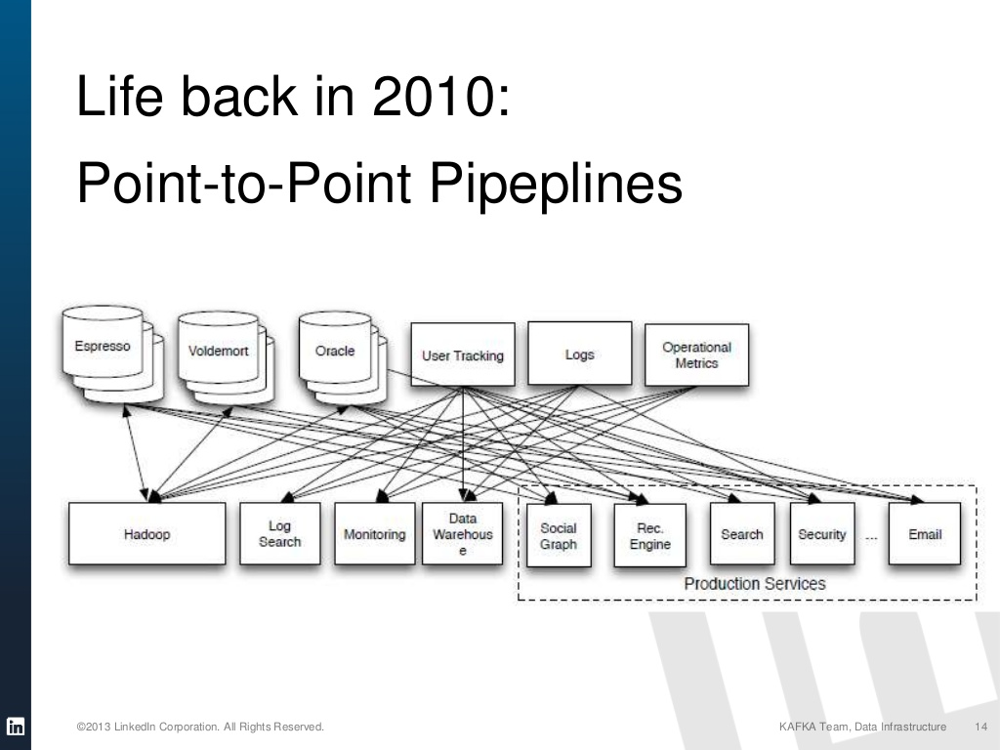
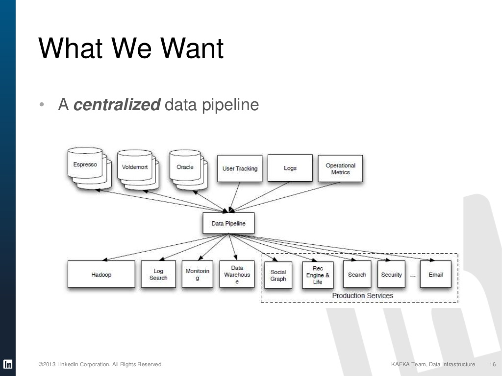
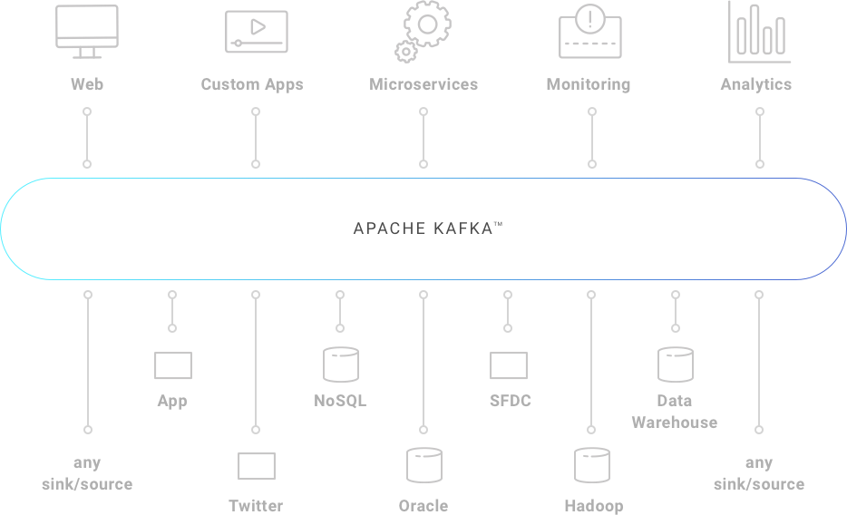

## Kafka

# Confluent Schema Regsitry

https://docs.confluent.io/current/quickstart/ce-docker-quickstart.html

kafka zookeeper 등 기본 기능 연결시켜서 완성

큰 모듈 완성 시키고 일반화

나중정리 

# 1. 카프카란 무엇인가?

- 대규모 메시지 데이터를 빠르게 처리하도록 개발된 메시징 플랫폼
- 책이나 인터넷에 기본 설명 있음 간단히 설명
- 기존에는 Point-to-point 파이프라인  -> 시스템 하나 넣을때마다 복잡해짐

- 중앙에서 kafka 가 관리 편해짐

- 카프카 공식 홈페이지 그림  -> 원하는거

## 카프카 특징

### 프로듀서와 컨슈머 분리

- 기존 pub/sub 모델을 기반으로 만들어짐 
  - 기존 pub/sub 은 간단한 이벤트를 전송하는데 사용 -> 카프카는 대규모 데이터에 사용

- 디스크에 메세지 저장 
  - 카프카는 컨슈머가 메세지를 읽더라도 정해져 있는 보관 주기동안 디스크에 메세지를 저장
  - 카프카는 기본으로 7일 저장된다고함 
  - 메세지가 디스크에 저장되어있기때문에 오류가 있어도 끄고 고치고 다시 실행하면 메세지 손실없이 작업 가능
- 확장성
  - 카프카 클러스터는 3대의 브로커로 시작해 수십대의 브로커로 확장 가능 , 확장작업은 서비스 중단없이 온라인 상태에서 작업이 가능