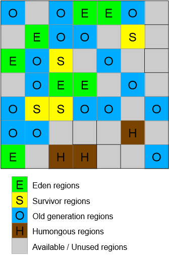
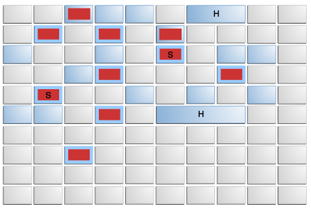

GC 종료
Serial Collector

- 싱글 스레드로 모든 종류의 가비지 컬렉션을 수행
- 실글 프로세서 시스템에 가장 적합
  - 멀티 프로세서 하드웨어를 활용 X
  - 멀티 프로세서 환경에서도 소형 데이터셋(최대 100MB정도)을 다루는 애플리케이션이라면 쓸만함
- 시스템 환경에 따라 선택되거나, -XX:+UseSerialGC 옵션으로 선택가능
- Young Generation Collection 알고리즘 : Serial
- Old Generation Collection 알고리즘 : Serial Mark-Sweep-Compact

Parallel Collector 
- 마이너 컬렉션을 병렬로 수행
  - GC의 오버헤드를 현저하게 줄임
- 멀티 프로세서나 멀티 스레드 하드웨어에서 돌아가는 중대형 규모의 데이터셋을 다루는 애플리케이션을 위한 GC
- 시스템 환경에 따라 선택되거나, -XX:+UseParallelGC 옵션으로 선택가능
- Parallel Compaction 
  - Parallel Collector가 Major Collection을 병렬로 수행하게 해주는 기능
  - Parallel Compaction을 사용 안하면 싱글 스레드만으로 Major Collection을 작동하므로 확장성 제한
  - XX:+UseParallelGC 옵션을 지정하면 Parallel Compaction이 디폴트로 사용된다.
  - XX:-UseParallelOldGC 옵션을 지정하면 Parallel Compaction을 사용하지 않는다.
- Young Generation Collection 알고리즘 : Parallel Scavenge
- Old Generation Collection 알고리즘 : Serial Mark-Sweep-Compact
- 멀티 쓰레드를 사용한 collection이 young 영역에만 국한

Concurrent Collectors
- 전체 처리율보다 응답 시간이 더 중요한 경우 사용
  - 프로세서가 GC와 처리 역할을 나누어 일하기 때문에 일시정지가 짧아짐
  - 프소세서 수를 늘릴수록 효과를 볼 수 있지만 한계가 있음

Concurrent Mark Sweep(CMS) Collector 
- 가비지 컬렉션 일시 정지가 짧은 것을 선호하는 애플리케이션을 위한 컬렉터
- 이 방식은 프로세서 리소스를 가비지 컬렉션과 공유
- heap 메모리 영역의 크기가 클 때 적합 
- GC의 일시 정지 시간을 줄이는 것이 목적이며, 크기가 큰 오래된 객체가 있는 경우에 적합
- XX:+UseConcMarkSweepGC 옵션으로 CMS 컬렉터를 켤 수 있다.
- Young Generation Collection 알고리즘: Parallel
- Old Generation Collection 알고리즘: Concurrent Mark-Sweep

Concurrent Mark-Sweep 알고리즘

이 방식은 다음의 네 단계를 따른다.

1. Initial Mark Phase
  - 애플리케이션 일시 정지.
  - GC에 싱글 스레드를 사용.
    - 애플리케이션의 Root set과 직접적으로 관계가 있는 살아있는 객체만 마크한다.
2. Concurrent Mark Phase
GC 스레드는 GC 작업을 하고, Working 스레드는 애플리케이션 작업을 한다.
GC에 싱글 스레드를 사용.
바로 전 단계에서 체크한 객체가 바라보고 있는 객체들을 추적해 살아있는지 마크한다.
Remark Phase
애플리케이션 일시 정지.
GC에 멀티 스레드 사용.
마크한 객체를 다시 추적해, 살아있는지 확인한다.
Concurrent Sweep Phase
애플리케이션은 멈추지 않고 작업을 계속한다.
GC에 싱글 스레드 사용.
Sweep: 살아있는 객체를 제외한 죽은 객체를 모두 삭제한다.
compaction(조각 모음)은 하지 않는다.
따라서, Sweep을 하다 보면 단편화가 발생한다.
Free List를 사용해 단편화를 최소화한다.


---

GC, 힙메모리, 런타임 컴파일러 기본값
- G1GC
- GC 쓰레드 최대 개수는 이용가능한 CPU와 힙메모리 영역으로 제한됨
- 초기 힙메모리 : 물리적 메모리의 1/64
- 최대 힙메모리 : 물리적 메모리의 1/4
- Tiered compiler는 C1,C2 둘다 사용


---


GC 설정
-Xms 최소
-Xmx 최대

---

## GC 전략 

최대 일시정지 시간 목표와 처리율 목표 두가지 목표 중 우선 하나의 목표를 충족하도록 구성, 선호하는 목표가 충족되면 다른 목표 극대화시킴 , 항상 충족되는 것은 아님

###  최대 일시정지 시간 목표

- 일시정지 시간은 Collector가 애플리케이션을 중지하고 메모리를 recover하는 시간- 
-  응답성이 중요한 애플리케이션
- GC 일시정지시간의 평균에 분산을 더한 값이 최대 일시정지 시간 목표 보다 크면 충족 X
- 최대 일시정지시간은  `-XX:MaxGCPauseMillis=<nnn>` (milliseconds) 으로 설정
- 최대 일시정지시간은 Collector 마다 다름
- 가비지 컬렉터는 해당 목표를 유지 하기 위해 heap크기 및 기타 매개변수를 조정 
  - 이러한 조정으로 가비지 컬렉터가 자주 발생하여 , 애플리케이션 전체 처리율이 감소할 수 있음
  - 이렇게 하더라도 몇 가지 경우에서 해당 목표를 충족 못시킬때가 있음
### Throughput(처리율) 목표

- 처리율은 Garbage를 모으는데 사용한 시간, 가비지 컬렉션 외부에서 사용된 시간은 애플리케이션 시간

- 처리율 = 애플리케이션 시간/ 가비지 시간

- `-XX:GCTimeRatio=*nnn*`  으로 설정, `1/1+nnn`

  - ```
             가비지 컬렉션 시간                                    1
     -------------------------------    =      ------------------------------------
     애플리케이션시간 + 가비지컬렉션 시간             애플리케이션 시간/가비지 시간(nnn) +1
     
     가비지 컬렉션 시간
     ---------------- 
     전체시간 
    ```

  - -XX:GCTimeRatio=19 일 경우, 1/20 => 즉 전체 시간의 5%를 가비지 컬렉션에 사용

- 가비지 수집의 소요된 시간은 가비지 수집으로 인한 일시정지에 대한 총 시간,

- 처리율 목표가 충족하지 않을 경우, 힙메모리를 늘려 애플리케이션에 소요되는 시간을 길게 만듦 -> 더 많이 모아서 처리하기때문에 일시정지가 늘어남

### FootPrint

- 처리율과 최대 일시정지 시간을 만족하면 가비지 컬렉터는 두 목표를 충족할 수 없을 때까지 힙크기를 줄임
- 가비지 컬렉터가 사용할 수 있는 최대 최소힙크기는 `-Xms=`*<nnn>* 및 `-Xmx=`*<mmm>* 를 사용


## 가비지 컬렉터 구현
### Generational Garbage Collection

- 이론적으로 가장 쉬운 가비지 컬렉터 알고리즘은 실행 될때마다 도달 가능한 모든 객체를 반복 -> 라이브 객체와 걸리는 시간이 비례하므로 대용량 애플리케이션에서는 금지


- 일반적으로  대부분 객체는 초반에 사용되고 삭제됨 -> Generation(young , old) 형태로 구현


### Generation

- Young Object : 신생 객체
- Old Object : 오래된 객체
- 대부분 객체들은 Young generation에서 죽음 
- 각 세대가 가득 차면 가비지 콜렉션 발생
- Young Generation이 가득 차면 Miner Collection이 발생 , Old Generation에서는 발생 안함
  - Collection Resource 는 살아있는 객체와 비례
- Old Generation이 가득 차면 Major Garbage Collection 발생, 전체 Heap 메모리 수집되기 때문에 Miner Collection보다 훨씬 오래 걸림


- 신생객체는 Eden 에 생성, 이후 Suvivor 를 거치고 Old 영역으로 이동 => aging 


### 처리율 및 측정

GC 보는 방법 

- 옵션 : -verbose:gc  , -Xlog:gc. 같음

- 더 많은 정보 : -Xlog:gc*


GC 상황 모니터링

- 현재 상황 모니터링

```
$ jstat -gcutil 21719 1s
S0 S1 E O P YGC YGCT FGC FGCT GCT  
48.66 0.00 48.10 49.70 77.45 3428 172.623 3 59.050 231.673  
48.66 0.00 48.10 49.70 77.45 3428 172.623 3 59.050 231.673  
```

YGCT/YGC = 0.05(50ms)초 가 나옴, Young GC가 수행되는데 평균 50ms 소요 된다는말 

FGCT/FGC = 19.68초 

- 로그 모니터링 

  - verbosegc 옵션 남겨서 로그 분석툴로 확인 (HPJMeter 추천)

- GC 튜닝 필요없는 상황

  상황에 따라 다르지만 일반적으로 다음과 같음

  - Minor GC의처리시간이빠르다(50ms내외).
  - Minor GC 주기가빈번하지않다(10초내외).
  - Full GC의처리시간이빠르다(보통1초이내).
  - Full GC 주기가빈번하지않다(10분에 1회).


GC상황을 확인 할 때 소요되는 시간만 확인 하면안되고 , 빈도도 확인해야함. New 영역이 작게 잡히면 Minor GC 빈도가 높아지고 Major GC 빈도도 증가하는 상황 발생할 수 있음

- Jstat -gccapacity로 각 영역이 얼마나 점유하여 사용하는지 확인


## 4 Factors Affecting Garbage Collection Performanace

### Total Heap

- 성능에 가장 큰 영향 미치는 거는 Total Available Memory
  - Generations 가 채워지면 Collection이 발생하기 때문에
  -  Throughput은 이용가능한 메모리양의 역비례 ? 
- 두번째 영향 Young 비율
  - Young이 크면 Minor Collection은 자주 안일어남, 제한된 Total Heap 에서 Young이 크면 Old 가 작아지고,  결국 Major Collection이 자주일어나게됨
  - 때문에 각 객체들의 Life Time을 확인 해볼 필요가 있음

- -Xmx 는 최대 공간, -Xms 최소공간,  Xmx>Xms 면 Xmx 크기가 할당 안되고 남은 크기만큼 가상공간이 생성

- 가상 공간은 Young , Old 영역으로 할당 될 수 있음
- 성능 옵션

```
-XX:MinHeapFreeRatio=<minimum>  : Virtual 최소 비율
-XX:MaxHeapFreeRatio=<maximum>  : Virtual 최대 비율
-Xmx<max>						: 최대 메모리
-Xms<min>						: 최소 메모리
-XX:NewRatio<nn>				: 1:nn = young(eden + survivor) : old 
	- 3일 경우 1:3 =young:old , young이 전체공간의 1/4 
-XX:NewSize						: Young의 최소 사이즈
-XX:MaxNewSize					: Young의 최대 사이즈, 없으면 제한 X
-XX:SurvivorRatio
```

- Xmx ==Xms 일경우 Total Heap 사이즈 고정, NewSize == MaxNewSize 면 Young 크기 고정
- Xmx, Xms , NewSize, MaxNewSize로만 튜딩하는것이  NewRatio 하는것 보다 좋음
- MinHeapFreeRatio를 0.4 로 해놓을 때, 남은공간이 40% 밑으로 떨어지면 virtual을 확장해서 40% 비율을 맞춤
- Xms,Xmx 를 갖게하면 jvm이 메모리 변경에 대한 결정을 제거 함으로써 예측 가능성이 높아짐, 그러나 잘못된 선택을 할 경우 jvm으로 부터 보상(교정?)을 받을 수 없음


### 결론 서버 튜닝 가이드

GC 상황을 보고 튜닝 해야하는데 FullGC 사용 시간이 0.1~0.3 밖에 안되면 GC 튜닝에 시간낭비할 필요가 없음

1~3초, 그이상 일경우 GC 튜닝이 필요.


1. Max Total Heap 사이즈 결정
   - 최상의 셋팅을 잡기위해서 Young 성능 상태를 plot
   - Xms,Xmx
2. 주어진 시간에 애플리케이션이 사용하는 모든 Live Data+ 10~20% 이상을 old 영역으로 지정
   - NewRatio
3. Young를 늘림
   - NewSize, MaxNewSize


# 정리


## GC

### GC?

GC(Garbage Collection)란 힙 메모리에 저장된 쓰레기 객체를 정리(메모리 해제)하는 것

- 자바 개발자는 GC가 메모리 관리 해주기때문에  메모리 관리를 위한 로직을 만들 필요가 없다.

- System.gc()는 GC 수동 코드 , 시스템 영향이 크기때문에 절대 사용금지


#### Weak Generational Hypothesis

- 대부분의 객체는 금방 Unreachable 상태가 된다.
- 오래된 객체에서 신생객체 참조는 아주 적게 존재한다.


Weak Generational Hypothesis 가설로 메모리를 Young, Old 영역으로 나눔

- Young(Young Generation) : 신생객체는 대부분 Young 영역에 위치
  - Young 영역은 Eden, Survivor1, Survivor2 영역으로 이루어짐
- Old(Old Generation) : Young 영역에서 살아남은 객체가 복사되는곳, 대부분 Young 보다 크게 할당되며 크기가 큰 만큼 GC는 적게 발생
- Permanent(Permanent Generation) : Weak Generational Hypothesis로 나뉜 영역은 아니고 클래스 로더에 의해 로드되는 클래스, 메소드 등에 대한 메타정보가 저장되는 영역으로 어플리케이션이 아닌 JVM에 의해 사용된다. 리플렉션을 사용하여 동적으로 클래스가 로딩되는 경우에 사용되기도 한다. 또한 Method Area라고 불린다.


#### Minor GC , Major GC

- Minor GC : Eden 영역이 가득 찰때 발생하는 GC
  - Old에서 Young 객체를 참조할때
    - Old 영역에는 카드테이블 존재하여 old 객체가 young 객체를 참조할때 정보 표시하고,  minor GC 가 발생할때는 old영역의 모든 객체를 참조하지 않고 카드테이블을 읽어 GC 대상 확인함
  - 실행 순서
    - 1회차 Eden 살아남은 객체 + S0영역에서 살아남은객체  => S1 영역복사, Age가MaxTeuringThreshold 이상인 객체는 Old 영역으로 복사
    - 2회차 Eden 살아남은 객체 + S1영역에서 살아남은객체  => S0 영역복사, Age가 MaxTeuringThreshold 이상인 객체는 Old 영역으로 복사

- Major GC(Full GC) : Old 영역과 Permanent영역이 가득 찰때 발생하는 GC
  - Young , Old, Permanent 영역 모두 GC 발생


GC 알고리즘은 다른곳에서 잘 설명 되어있어 참조함

[Minor GC, Major GC 알고리즘](https://d2.naver.com/helloworld/1329)

#### GC 튜닝?

Full GC가 발생하면 JVM은 애플리케이션을 멈추고 GC를 진행한다. 멈추는 시간을 STW(stop-the-world)라고 하며 이 STW를 줄이는 것이 GC 튜닝이다.


## GC 종류

아래와 같은 여러 Collector가 있지만 Java 9부터 Default인 G1GC에 대해서 정리함

- Serial GC
- Parallel GC
- Parallel Old GC(Parallel Compacting GC)
- Concurrent Mark & Sweep GC(이하 CMS)
- G1(Garbage First) GC

### G1GC

G1GC: Garbage First Garbage Collector

#### G1GC 특징

- G1은 큰 메모리를 가진 멀티 프로세서 시스템에서 사용하기 위해 개발된 GC이다.
- GC 일시 정지 시간을 최소화하면서, 따로 설정을 하지 않아도 가능한 한 처리량(throughput)도 확보하는 것이 G1GC의 목표이다.
- G1은 Java 9부터 디폴트 GC이다.
- `G1은 실시간(real time) GC가 아니다. `일시 정지 시간을 최소화하긴 하지만 완전히 없애지는 못한다.
- G1은 통계를 계산해가면서 GC 작업량을 조절한다.

다음 상황이라면 G1을 쓰면 도움이 된다.

- Java heap의 50% 이상이 라이브 데이터.
- 시간이 흐르면서 객체 할당 비율과 프로모션 비율이 크게 달라진다.
- GC가 너무 오래 걸린다(0.5 ~ 1초).


#### 활성화

- Java 9 이후로는 기본값, 이전버전은 -XX:+UseG1GC 옵션 사용


#### 작동방식

G1GC의 힙 레이아웃은 다른 generational collector와 좀 다르다.

**G1GC는 전체 heap을 체스판처럼 여러 영역(region)으로 나누어 관리한다.**

따라서 G1은 영역의 참조를 관리할 목적으로 remember set를 만들어 사용한다. remember set은 total heap의 5% 미만 크기.

- Remember Set (RSet): 객체가 어떤 region에 저장되어 있는지 기록한 자료구조입니다.
- Collection Set (CSet): GC가 수행될 region이 저장되어 있는 자료구조입니다.

일시 정지 시간 목표에 맞춰 Young 영역을 설정, Young 영역은 Min, Max 까지 사이즈 중에서 결정됨




- 기본 Region 목표 수치는 2048개의 공간으로 나눌 수 있도록함
  - 8G 메모리 할당시 8G/2048 = 4MB
- eden, survivor, old, humongous, available/unused 영역으로 나뉨
  - humongous은 큰 객체
  -  available/unused은 사용하지 않는 영역


- 쓰레기가 쌓여 꽉 찬 영역을 우선적으로 청소한다.
- 꽉 찬 영역에서 라이브 객체를 다른 영역으로 옮기고, 꽉 찬 영역은 깨끗하게 비운다.
- 이렇게 옮기는 과정이 조각 모음의 역할도 한다.





- 빨간색은 Eden으로 쓰이고 있는 영역을 의미한다.
- 빨간색 S는 Survivor. Eden이 꽉 차면 라이브 객체를 S로 옮기고 Eden은 비워버린다.
- 파란색은 old gen 처럼 쓰이고 있는 영역이다.
- 파란색 H는 한 영역보다 크기가 커서 여려 영역을 차지하고 있는 커다란 객체이다(Humongous Object).

G1GC는 일시 정지 시간을 줄이기 위해 병렬로 GC 작업을 한다. 각각의 스레드가 자신만의 영역을 잡고 작업하는 방식.


#### GC 과정

- Eden 영역에 신생객체 할당, 크기가 클 경우 Humongous 영역에 할당
- Eden 영역 한계에 다다르면  Minor GC 발생
- Eden 영역에서 ‘from-space’ Survivor로 이동 (STW 발생)
-  ‘from-space’ survivor region에서 살아남은 객체들은 ‘to-space’ survivor region으로 이동되거나, 객체의 살아남은 횟수가 한계를 넘으면(tenuring threshold), old 영역의 region으로 이동 


- G1 GC 수행 과정은 **Evacuation Pauses(=Minor GC), Concurrent Cycle, Mixed GC**가 있다.

- **Evacuation Pauses(=Minor GC)**

- - Evacuation Pauses(=Minor GC)일 때 **eden과 survivor**에 있는 유효 객체(Live objects)를 적절한 region을 찾아 대피시키도록(Copying) 한다.
  - Evacuation Pauses(=Minor GC)일 때 GC 대상의 region 선택은 사용자가 옵션으로 지정한 pause time과 G1 GC 내부에서 사용하는 휴리스틱 알고리즘에 의해 선택된다. 그 이유는 G1 GC의 중요한 목표 중 하나는 실시간성 향상에 있기 때문이다.(Hard real-time이 아닌 휴리스틱 알고리즘에 의한 Soft real-time Goal이다.)
  - Evacuation Pauses는 빨리 완수하기 위해 JVM에서 **Multi-threaded**로 동작한다.
  - Young Generation **Stop-the-world** 구간이다. (CMS와 다름)

- - Survivor region은 liveness objects를 판단하기 위해, Eden region은 pause time을 예측하는데 사용된다.
  - **minor GC 때마다 Eden과 Survivor 영역 크기는 변경될 수 있다.**
  - Eden에 있는 live object는 Survivor 영역으로, Survivor from은 Survivor to로, Survivor to는 OLD 영역으로 이동
  - 논문에서는 첫 Evacuation Pauses는 일정 용량이상 차면 수행 되고, 그 이후에는 사용자가 지정한 pause duration과 per-byte copying Cost에 의해 결정된다고 한다. 얼마나 많은 Live object를 to-survivor regions에 복사할지 추정하는데 단위 바이트당 소요될 Cost와 pause duration P의 곱이 제한 시간 내 복사할 수 있는 용량으로 산정해서 동작한다.
  - 각 region에는 Live Data Counting 정보를 가지고 있다. 이 정보를 바탕으로 region 영역이 먼저 Garbage 되어야 하는지 결정된다.(그래서 이름이 Garbage First, G1 이다).

- - **External Root Scanning**: gc thread들이 registers, thread stacks에서 root 노드를 검색하는 단계

  - **Update Remembered Sets**: RSet 정보를 갱신하는 단계

  - - **Processed Buffers**: worker thread가 얼마나 많은 update 버퍼 정보를 갱신했는지 보여준다.

- - **Scan Rsets**: 업데이트 된 Rset 정보를 기반으로 region을 향해 가진 reference를 가진 객체들을 탐색한다.
  - **Object Copy**: Scan Rsets에서 탐색한 객체들을 복사하기 시작한다. Eden에 있는 객체들을 from-space로, from-space에 있는 객체들을 to-space로, to-space에 있던 객체들을 Old 영역으로 복사한다.
  - **Termination**: GC thread들은 객체 탐색 및 객체 복사의 일이 끝나면 Termination 단계에 들어간다. Task 처리의 로드밸런싱 효율을 높이기 위한 방법으로 Work-stealing 기법을 사용하고 있다.
  - **Parallel Worker Other time**: 위에서 언급한 일 이외의 다른 부수적인 일을 처리한 시간
     

- **Concurrent Cycle**

- - **-XX:InitiatingHeapOccupancyPercent (IHOP)** 에서 정한 수치가 넘어가면 동작한다.

  - OLD 영역을 GC하기위한 전초 작업이다.

  - - **initial mark**: **multi-threaded**로 동작하며, minor GC때 수행 한다. (CMS와 다름. CMS에서 initial mark는 stop-the-world 구간이다.)
    - **Root region Scanning**: **multi-threaded**로 동작하며, **Application과 Concurrent**하게 동작한다. 이때 Old 영역으로 reference를 가진 **survivor-regions**을 검색한다. 이 단계가 끝나야 Evacuation Pauses(Minor GC)가 동시에 실행될 여지가 발생한다.(Survivor regions 영역은 Evacuation Pauses(Minor GC)에서도 탐색하기 때문)
    - **Concurrent marking**: **multi-threaded**로 동작하고, **Application과 Concurrent**하게 동작한다. 모든 rechable / live 객체들을 마킹한다. 이 때부터 Evacuation Pauses와 동시에 실행 가능하다.

  - - - GC 로그 예) [GC concurrent-mark-start]
                         [GC concurrent-mark-end, ...

    - **Remark**: **Stop-the-world** 구간이다. **multi-threaded**로 동작한다. marking 작업을 마무리.

    - - GC 로그 예) [GC remark ....

    - **Cleanup**: **Partly Stop-the-world** 구간이다. **multi-threaded**로 동작한다. region 영역의 liveness 정보를 갱신하고, 적절한 free region을 식별한다. 논문에 의하면 Cleanup 할 때, 각 region의 GC 효율을 기준으로 정렬하는데(G1 first, cost efficiency), GC 효율 측정 factor에 remember set의 size등을 고려하는데 이러한 작업을 하기 위한 기본 데이터 값들을 정리한다.
      (Updates region liveness and identifies completely free regions along with remembered set scrubbing)

    - - GC 로그 예) [GC cleanup, ...

    - **Concurrent-Cleanup**: empty region 자료구조를 Reset하고, available/Unused regions list에 추가한다.

    - - GC 로그 예) [GC concurrent-cleanup-start]
                          [GC concurrent-cleanup-end, ...

- **Mixed GC**

- - Mixed GC일 때 Young영역과 Old 영역을 Garbage collection 한다.(단어에서 의미하듯 Mixed이다.)
  - OLD region 영역의 GC 선택 기준은 liveness를 기준으로 판단한다. Garbage Collection 효율을 높이기 위해 liveness가 높은 것은 재사용될 가능성이 높다고 판단하기에 liveness가 적은 것을 GC하도록 한다.(따라서 Garbage First, G1이라는 이름이 붙었다.)
  - Mixed GC는 기본적으로 8회 수행되도록 되어 있다. 1회의 Mixed GC에 모든 OLD 영역이(Old regions) Garbage collection되지 않는다. 한번에 Garbage를 정리하기에 Cost가 매우 크기 때문이다.
  - minor GC 처럼 Eden과 Survivor 영역 크기는 변경될 수 있다.
  - Mixed GC는 Evacuation Pauses때 수행하는 단계와 동일하다. Evacuation Pauses인데 OLD region을 추가적으로 GC 하는 것이다. Mixed GC = Evacuation Pauses(Young GC + OLD GC)
  - Mixed GC 때 선택되는 CSet은(Old regions) **-XX:G1MixedGCCountTarget (defaults to 8)**와 **-XX:G1OldCSetRegionThresholdPercent** 에 영향받는다. OLD 영역에 관한 CSet Tuning과 관련있다.
  - Mixed GC 선택 대상 결정은 **-XX:G1MixedGCLiveThresholdPercent**,**-XX:G1HeapWastePercent**에 영향 받는다.


https://initproc.tistory.com/entry/G1-Garbage-Collection


## 튜닝 가이드


## Reference

https://d2.naver.com/helloworld/1329

https://d2.naver.com/helloworld/6043

https://d2.naver.com/helloworld/37111


문서 번역본

https://johngrib.github.io/wiki/java-g1gc/


G1GC 설명

https://initproc.tistory.com/entry/G1-Garbage-Collection


# 메모리 힙덤프 및 분석


## 힙덤프

jps : 자바 pid 확인

 jmap : 힙덤프

```shell
$jps
3780 OBSyslogd
2922 Bootstrap
14284 Jps
4476 OBSysmon
3405 OBAdcmon

# $jmap -dump:format=b,file=파일이름 PID
$jmap -dump:format=b,file=heap.hprof 3405
```


## 분석

Eclipse Mat으로 분석

