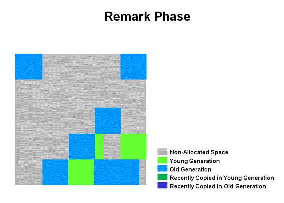
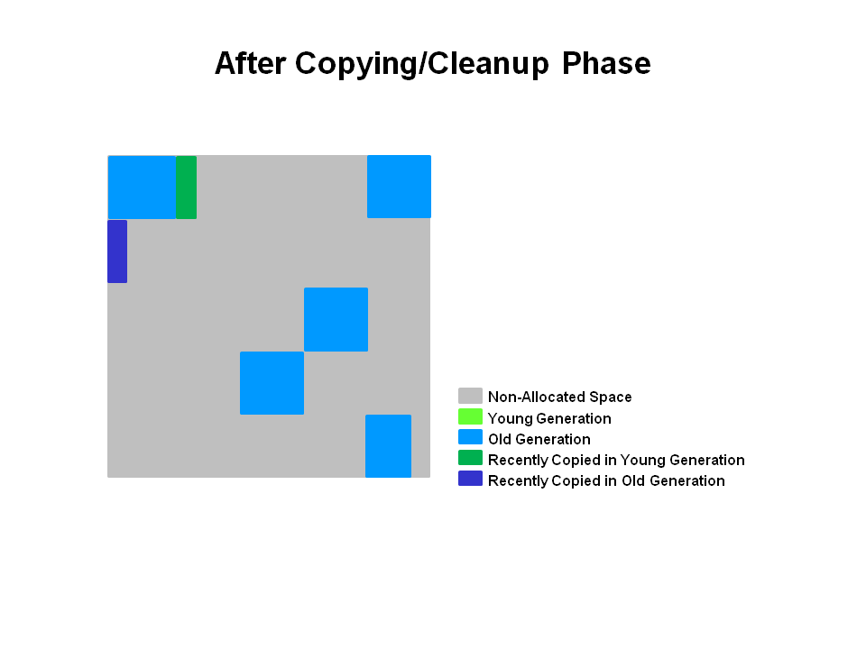

# GC

### GC?

GC(Garbage Collection)란 힙 메모리에 저장된 쓰레기 객체를 정리(메모리 해제)하는 것

- 자바 개발자는 GC가 메모리 관리 해주기때문에  메모리 관리를 위한 로직을 만들 필요가 없다.

- System.gc()는 GC 수동 코드 , 시스템 영향이 크기때문에 절대 사용금지


#### Weak Generational Hypothesis

- 대부분의 객체는 금방 Unreachable 상태가 된다.
- 오래된 객체에서 신생객체 참조는 아주 적게 존재한다.


Weak Generational Hypothesis 가설로 메모리를 Young, Old 영역으로 나눔

- Young(Young Generation) : 신생객체는 대부분 Young 영역에 위치
  - Young 영역은 Eden, Survivor1, Survivor2 영역으로 이루어짐
- Old(Old Generation) : Young 영역에서 살아남은 객체가 복사되는곳, 대부분 Young 보다 크게 할당되며 크기가 큰 만큼 GC는 적게 발생
- Permanent(Permanent Generation) : Weak Generational Hypothesis로 나뉜 영역은 아니고 클래스 로더에 의해 로드되는 클래스, 메소드 등에 대한 메타정보가 저장되는 영역으로 어플리케이션이 아닌 JVM에 의해 사용된다. 리플렉션을 사용하여 동적으로 클래스가 로딩되는 경우에 사용되기도 한다. 또한 Method Area라고 불린다.


#### Minor GC , Major GC

- Minor GC : Eden 영역이 가득 찰때 발생하는 GC
  - Old에서 Young 객체를 참조할때
    - Old 영역에는 카드테이블 존재하여 old 객체가 young 객체를 참조할때 정보 표시하고,  minor GC 가 발생할때는 old영역의 모든 객체를 참조하지 않고 카드테이블을 읽어 GC 대상 확인함
  - 실행 순서
    - 1회차 Eden 살아남은 객체 + S0영역에서 살아남은객체  => S1 영역복사, Age가MaxTeuringThreshold 이상인 객체는 Old 영역으로 복사
    - 2회차 Eden 살아남은 객체 + S1영역에서 살아남은객체  => S0 영역복사, Age가 MaxTeuringThreshold 이상인 객체는 Old 영역으로 복사

- Major GC(Full GC) : Old 영역과 Permanent영역이 가득 찰때 발생하는 GC
  - Young , Old, Permanent 영역 모두 GC 발생


GC 알고리즘은 다른곳에서 잘 설명 되어있어 참조함

[Minor GC, Major GC 알고리즘](https://d2.naver.com/helloworld/1329)

#### GC 튜닝?

Full GC가 발생하면 JVM은 애플리케이션을 멈추고 GC를 진행한다. 멈추는 시간을 STW(stop-the-world)라고 하며 이 STW를 줄이는 것이 GC 튜닝이다.


## GC 종류

아래와 같은 여러 Collector가 있지만 Java 9부터 Default인 G1GC에 대해서 정리함

- Serial GC
- Parallel GC
- Parallel Old GC(Parallel Compacting GC)
- Concurrent Mark & Sweep GC(이하 CMS)
- G1(Garbage First) GC

### G1GC

G1GC: Garbage First Garbage Collector

#### G1GC 특징

- G1은 큰 메모리를 가진 멀티 프로세서 시스템에서 사용하기 위해 개발된 GC이다.
- GC 일시 정지 시간을 최소화하면서, 따로 설정을 하지 않아도 가능한 한 처리량(throughput)도 확보하는 것이 G1GC의 목표이다.
- G1은 Java 9부터 디폴트 GC이다.
- `G1은 실시간(real time) GC가 아니다. `일시 정지 시간을 최소화하긴 하지만 완전히 없애지는 못한다.
- G1은 통계를 계산해가면서 GC 작업량을 조절한다.
- 긴 정지시간 없이 Free Memory Compact 능력
- 큰 힙사이즈에 좋음
- 다른 콜렉터와 다르게 여러 튜닝 방법이 있다.

다음 상황이라면 G1을 쓰면 도움이 된다.

- Java heap의 50% 이상이 라이브 데이터.
- 시간이 흐르면서 객체 할당 비율과 프로모션 비율이 크게 달라진다.
- GC가 너무 오래 걸린다(0.5 ~ 1초).


- 자바 8에서 FullGC는 싱글스레드로 느리기 때문에 피해야함
- 거대객체가 있을경우 느림?
- 가비지콜렉터는 가비지가 가장많은 영역을 우선 처리함

#### 활성화

- Java 9 이후로는 기본값, 이전버전은 -XX:+UseG1GC 옵션 사용


#### 작동방식

G1GC의 힙 레이아웃은 다른 generational collector와 좀 다르다.

**G1GC는 전체 heap을 체스판처럼 여러 영역(region)으로 나누어 관리한다.**

따라서 G1은 영역의 참조를 관리할 목적으로 remember set를 만들어 사용한다. remember set은 total heap의 5% 미만 크기.

- Remember Set (RSet): 객체가 어떤 region에 저장되어 있는지 기록한 자료구조입니다.
- Collection Set (CSet): GC가 수행될 region이 저장되어 있는 자료구조입니다.

일시 정지 시간 목표에 맞춰 Young 영역을 설정, Young 영역은 Min, Max 까지 사이즈 중에서 결정됨


- 기본 Region 목표 수치는 2048개의 공간으로 나눌 수 있도록함
  - 8G 메모리 할당시 8G/2048 = 4MB
- eden, survivor, old, humongous, available/unused 영역으로 나뉨
  - humongous은 큰 객체
  -  available/unused은 사용하지 않는 영역


- 쓰레기가 쌓여 꽉 찬 영역을 우선적으로 청소한다.
- 꽉 찬 영역에서 라이브 객체를 다른 영역으로 옮기고, 꽉 찬 영역은 깨끗하게 비운다.
- 이렇게 옮기는 과정이 조각 모음의 역할도 한다.


- 빨간색은 Eden으로 쓰이고 있는 영역을 의미한다.
- 빨간색 S는 Survivor. Eden이 꽉 차면 라이브 객체를 S로 옮기고 Eden은 비워버린다.
- 파란색은 old gen 처럼 쓰이고 있는 영역이다.
- 파란색 H는 한 영역보다 크기가 커서 여려 영역을 차지하고 있는 커다란 객체이다(Humongous Object).

G1GC는 일시 정지 시간을 줄이기 위해 병렬로 GC 작업을 한다. 각각의 스레드가 자신만의 영역을 잡고 작업하는 방식.


#### GC 과정

- Eden 영역에 신생객체 할당, 크기가 클 경우 Humongous 영역에 할당
- Eden 영역 한계에 다다르면  Minor GC 발생
- Eden 영역에서 ‘from-space’ Survivor로 이동 (STW 발생)
-  ‘from-space’ survivor region에서 살아남은 객체들은 ‘to-space’ survivor region으로 이동되거나, 객체의 살아남은 횟수가 한계를 넘으면(tenuring threshold), old 영역의 region으로 이동 
-  

- 
- - **initial mark**: 
    - **multi-threaded**로 동작
    - 보통 Minor GC의 Mark 단계에서 같이 이루어짐  (CMS와 다름. CMS에서 initial mark는 stop-the-world 구간이다.)
    - GC pause (young)(inital-mark)"로 로깅됨.
  
  - **Root region Scanning**: 
    - **multi-threaded**로 동작
    - **Application과 Concurrent**하게(애플리케이션 스레드와 함께) 동작한다. 
    - 이때 Old 영역으로 reference를 가진 **survivor-regions**을 검색한다. 
    - 이 단계가 끝나야 Evacuation Pauses(Minor GC)가 동시에 실행될 여지가 발생한다.(Survivor regions 영역은 Evacuation Pauses(Minor GC)에서도 탐색하기 때문)
      - 이부분 이해안됨
  
  
  
  - **Concurrent marking**: 
  
    - **multi-threaded**로 동작
    - **Application과 Concurrent**하게(애플리케이션 스레드와 함께)  동작
    - 모든 rechable / live 객체들을 마킹한다. 
    - 이 때부터 Minor GC와 동시에 실행 가능하다.
      - Minor GC에 의해 Interrupt 될 수 있다.
    - 이 과정에서, 완전 비어있는 Region을 찾게 되면(위 그림에서 X), Remark Phase에서 Unused 상태로 만든다.
    - GC 로그 예) [GC concurrent-mark-start]	
          [GC concurrent-mark-end, ...
  
    
  
  - **Remark**: 
  
    - **Stop-the-world** 구간
    - **multi-threaded**로 동작
    -  Concurrent Mark 단계 결과를 검증
    - Empty Region은 제거되어 반한되며, 모든 Region에 대해 Region Liveness가 재계산됨
    -  CMS GC의 Remark 단계와 달리, G1 GC의 Remark 단계에선 SATB(snapshot-at-the-beginning)이라는 알고리즘을 사용하는데, CMS GC의 것보다 훨씬 빠르다.
    - GC 로그 예) [GC remark ....
  
    
  
  - **Cleanup**: 
  
    - **Partly Stop-the-world** 구간이다. 
    - **multi-threaded**로 동작한다. 
    - G1은 가장 빠르게 Collect 되어지는 Region(가장 적은 Liveness Object를 가진 Region)을 선택하며, Young GC와 같은 시간에 수집,
      - 로그는 [GC pause (mixed)]로 기록
      - Young/old GC가 동시에 발생
    - region 영역의 liveness 정보를 갱신하고 적절한 free region을 식별한다. (이 부분이 STW)
    - RSet(Remembered Set) 정리(STW)
    - GC 로그 예) [GC cleanup, ...
  
  - **Concurrent-Cleanup**: 
  
    - Empty Region을 재정리하여 이 Region을 Free List(available/Unused regions list)에 추가(Concurrent , not STW)
    - GC 로그 예) [GC concurrent-cleanup-start]
          [GC concurrent-cleanup-end, ...
  
  
  
  - **After Copying/Cleanup Phase**	:	
    -   진한 녹색과 청색같이 선택된 Region은 Collect 되고 Compact 된다.


## 튜닝 가이드


## GC 전략 

최대 일시정지 시간 목표와 처리율 목표 두가지 목표 중 우선 하나의 목표를 충족하도록 구성, 선호하는 목표가 충족되면 다른 목표 극대화시킴 , 항상 충족되는 것은 아님

### 최대 일시정지 시간 목표

- 일시정지 시간은 Collector가 애플리케이션을 중지하고 메모리를 recover하는 시간- 
- 응답성이 중요한 애플리케이션
- GC 일시정지시간의 평균에 분산을 더한 값이 최대 일시정지 시간 목표 보다 크면 충족 X
- 최대 일시정지시간은  `-XX:MaxGCPauseMillis=<nnn>` (milliseconds) 으로 설정
- 최대 일시정지시간은 Collector 마다 다름
- 가비지 컬렉터는 해당 목표를 유지 하기 위해 heap크기 및 기타 매개변수를 조정 
  - 이러한 조정으로 가비지 컬렉터가 자주 발생하여 , 애플리케이션 전체 처리율이 감소할 수 있음
  - 이렇게 하더라도 몇 가지 경우에서 해당 목표를 충족 못시킬때가 있음

### Throughput(처리율) 목표

- 처리율은 Garbage를 모으는데 사용한 시간, 가비지 컬렉션 외부에서 사용된 시간은 애플리케이션 시간

- 처리율 = 애플리케이션 시간/ 가비지 시간

- `-XX:GCTimeRatio=*nnn*`  으로 설정, `1/1+nnn`

  - ```
        가비지 컬렉션 시간                                    1
    -------------------------------    =      ------------------------------------
    애플리케이션시간 + 가비지컬렉션 시간             애플리케이션 시간/가비지 시간(nnn) +1
    
    가비지 컬렉션 시간
    ---------------- 
    전체시간 
    ```

  - -XX:GCTimeRatio=19 일 경우, 1/20 => 즉 전체 시간의 5%를 가비지 컬렉션에 사용

- 가비지 수집의 소요된 시간은 가비지 수집으로 인한 일시정지에 대한 총 시간,

- 처리율 목표가 충족하지 않을 경우, 힙메모리를 늘려 애플리케이션에 소요되는 시간을 길게 만듦 -> 더 많이 모아서 처리하기때문에 일시정지가 늘어남

### FootPrint

- 처리율과 최대 일시정지 시간을 만족하면 가비지 컬렉터는 두 목표를 충족할 수 없을 때까지 힙크기를 줄임
- 가비지 컬렉터가 사용할 수 있는 최대 최소힙크기는 `-Xms=`*<nnn>* 및 `-Xmx=`*<mmm>* 를 사용


## 가비지 컬렉터 구현

### Generational Garbage Collection

- 이론적으로 가장 쉬운 가비지 컬렉터 알고리즘은 실행 될때마다 도달 가능한 모든 객체를 반복 -> 라이브 객체와 걸리는 시간이 비례하므로 대용량 애플리케이션에서는 금지


- 일반적으로  대부분 객체는 초반에 사용되고 삭제됨 -> Generation(young , old) 형태로 구현


### Generation

- Young Object : 신생 객체
- Old Object : 오래된 객체
- 대부분 객체들은 Young generation에서 죽음 
- 각 세대가 가득 차면 가비지 콜렉션 발생
- Young Generation이 가득 차면 Miner Collection이 발생 , Old Generation에서는 발생 안함
  - Collection Resource 는 살아있는 객체와 비례
- Old Generation이 가득 차면 Major Garbage Collection 발생, 전체 Heap 메모리 수집되기 때문에 Miner Collection보다 훨씬 오래 걸림


- 신생객체는 Eden 에 생성, 이후 Suvivor 를 거치고 Old 영역으로 이동 => aging 


### 처리율 및 측정

GC 보는 방법 

- 옵션 : -verbose:gc  , -Xlog:gc. 같음
- 더 많은 정보 : -Xlog:gc*


GC 상황 모니터링

- 현재 상황 모니터링

```
$ jstat -gcutil 21719 1s
S0 S1 E O P YGC YGCT FGC FGCT GCT  
48.66 0.00 48.10 49.70 77.45 3428 172.623 3 59.050 231.673  
48.66 0.00 48.10 49.70 77.45 3428 172.623 3 59.050 231.673  
```

YGCT/YGC = 0.05(50ms)초 가 나옴, Young GC가 수행되는데 평균 50ms 소요 된다는말 

FGCT/FGC = 19.68초 

- 로그 모니터링 

  - verbosegc 옵션 남겨서 로그 분석툴로 확인 (HPJMeter 추천)

- GC 튜닝 필요없는 상황

  상황에 따라 다르지만 일반적으로 다음과 같음

  - Minor GC의처리시간이빠르다(50ms내외).
  - Minor GC 주기가빈번하지않다(10초내외).
  - Full GC의처리시간이빠르다(보통1초이내).
  - Full GC 주기가빈번하지않다(10분에 1회).


GC상황을 확인 할 때 소요되는 시간만 확인 하면안되고 , 빈도도 확인해야함. New 영역이 작게 잡히면 Minor GC 빈도가 높아지고 Major GC 빈도도 증가하는 상황 발생할 수 있음

- Jstat -gccapacity로 각 영역이 얼마나 점유하여 사용하는지 확인


## 4 Factors Affecting Garbage Collection Performanace

### Total Heap

- 성능에 가장 큰 영향 미치는 거는 Total Available Memory
  - Generations 가 채워지면 Collection이 발생하기 때문에
  - Throughput은 이용가능한 메모리양의 역비례 ? 
- 두번째 영향 Young 비율
  - Young이 크면 Minor Collection은 자주 안일어남, 제한된 Total Heap 에서 Young이 크면 Old 가 작아지고,  결국 Major Collection이 자주일어나게됨
  - 때문에 각 객체들의 Life Time을 확인 해볼 필요가 있음
- -Xmx 는 최대 공간, -Xms 최소공간,  Xmx>Xms 면 Xmx 크기가 할당 안되고 남은 크기만큼 가상공간이 생성
- 가상 공간은 Young , Old 영역으로 할당 될 수 있음
- 성능 옵션

```
-XX:MinHeapFreeRatio=<minimum>  : Virtual 최소 비율
-XX:MaxHeapFreeRatio=<maximum>  : Virtual 최대 비율
-Xmx<max>						: 최대 메모리
-Xms<min>						: 최소 메모리
-XX:NewRatio<nn>				: 1:nn = young(eden + survivor) : old 
	- 3일 경우 1:3 =young:old , young이 전체공간의 1/4 
-XX:NewSize						: Young의 최소 사이즈
-XX:MaxNewSize					: Young의 최대 사이즈, 없으면 제한 X
-XX:SurvivorRatio
```

- Xmx ==Xms 일경우 Total Heap 사이즈 고정, NewSize == MaxNewSize 면 Young 크기 고정
- Xmx, Xms , NewSize, MaxNewSize로만 튜딩하는것이  NewRatio 하는것 보다 좋음
- MinHeapFreeRatio를 0.4 로 해놓을 때, 남은공간이 40% 밑으로 떨어지면 virtual을 확장해서 40% 비율을 맞춤
- Xms,Xmx 를 갖게하면 jvm이 메모리 변경에 대한 결정을 제거 함으로써 예측 가능성이 높아짐, 그러나 잘못된 선택을 할 경우 jvm으로 부터 보상(교정?)을 받을 수 없음


### 결론 서버 튜닝 가이드

GC 상황을 보고 튜닝 해야하는데 FullGC 사용 시간이 0.1~0.3 밖에 안되면 GC 튜닝에 시간낭비할 필요가 없음

1~3초, 그이상 일경우 GC 튜닝이 필요.


1. Max Total Heap 사이즈 결정
   - 최상의 셋팅을 잡기위해서 Young 성능 상태를 plot
   - Xms,Xmx
2. 주어진 시간에 애플리케이션이 사용하는 모든 Live Data+ 10~20% 이상을 old 영역으로 지정
   - NewRatio
3. Young를 늘림
   - NewSize, MaxNewSize


## Reference

https://d2.naver.com/helloworld/1329

https://d2.naver.com/helloworld/6043

https://d2.naver.com/helloworld/37111


문서 번역본

https://johngrib.github.io/wiki/java-g1gc/


G1GC 설명

https://initproc.tistory.com/entry/G1-Garbage-Collection

G1GC 설명 2(과정설명 잘되어있음)

https://lazymankook.tistory.com/83

G1GC 설명 3(제일 잘 설명)

https://imp51.tistory.com/entry/G1-GC-Garbage-First-Garbage-Collector-Tuning

G1GC 해외 가이드

https://medium.com/@fnote/g1gc-tuning-ec78d40861d


# 메모리 힙덤프 및 분석


## 힙덤프

jps : 자바 pid 확인

 jmap : 힙덤프

```shell
$jps
3780 OBSyslogd
2922 Bootstrap
14284 Jps
4476 OBSysmon
3405 OBAdcmon

# $jmap -dump:format=b,file=파일이름 PID
$jmap -dump:format=b,file=heap.hprof 3405
```


## 분석

Eclipse Mat으로 분석

