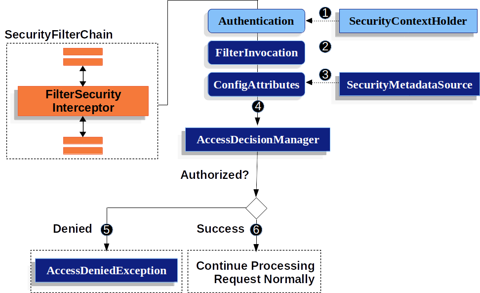
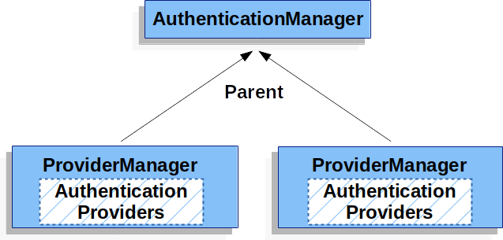

# 스프링 시큐리티


스프링 시큐리티 커스텀을 해야하는 일이 생겼는데 기본설정 밖에 못하여 공부하기로 했다.


## 스프링 시큐리티 이해
개인적으로 이해하고 만들었기 때문에 실제 내용과 다를 수 있음

### 스프링 시큐리티 필터


시큐리티 필터 ([이미지 참조](https://pupupee9.tistory.com/108))


DelegatingFilterProxy(GenericFilterBean-Filter)


- FilterChainProxy도 같은 Filter인데 왜 바로 적용안하고 DelegatingFilterProxy 사용하는 이유를 알아봤는데 스프링 빈을 사용하여 필터를 적용할때 사용한다고 한다. 
- "delegating to a Spring-managed `bean` that implements the Filter interface" ([참고](https://stackoverflow.com/questions/6725234/whats-the-point-of-spring-mvcs-delegatingfilterproxy))

```
 서블릿 필터를 프로젝트 중간에 교체 못해서 빈으로 교체되게 만든건가 ? => 서블릿 필터 교체 가능한지 확인
```

FilterChainProxy(GenericFilterBean-Filter)
- VirtualFilterChain를 생성하여 시큐리티 필터들 사용

```java

public class FilterChainProxy extends GenericFilterBean {
    ...
    @Override
    public void doFilter(ServletRequest request, ServletResponse response,
            FilterChain chain) throws IOException, ServletException {
        
            ...

            doFilterInternal(request, response, chain);

            ...
        }
    private void doFilterInternal(ServletRequest request, ServletResponse response,
                FilterChain chain) throws IOException, ServletException {

            ...
            // 시큐리티 필터 목록이 들어감
            List<Filter> filters = getFilters(fwRequest);

            ...

            VirtualFilterChain vfc = new VirtualFilterChain(fwRequest, chain, filters);
            vfc.doFilter(fwRequest, fwResponse);
        }
    ...


    private static class VirtualFilterChain implements FilterChain {
        
        ...
        
		@Override
		public void doFilter(ServletRequest request, ServletResponse response)
				throws IOException, ServletException {
	
            ...
            // 시큐리티 필터 진행 위치
            currentPosition++;

            Filter nextFilter = additionalFilters.get(currentPosition - 1);
            
            ...
            // 다음 시큐리티 필터 실행
            nextFilter.doFilter(request, response, this);
			
		}
	}
}
```

- 위의 VirtualFilterChain 에서 실제 additionalFilters객체는 다음과 같이 사용할 스프링 시큐리티 필터객체 들을 담고 있다.

```
org.springframework.security.web.context.request.async.WebAsyncManagerIntegrationFilter@32e0292f
org.springframework.security.web.context.SecurityContextPersistenceFilter@3d5c7a8b
org.springframework.security.web.header.HeaderWriterFilter@2584c69e
org.springframework.security.web.authentication.logout.LogoutFilter@721df40a
org.springframework.security.web.authentication.UsernamePasswordAuthenticationFilter@7e96e463
org.springframework.security.web.savedrequest.RequestCacheAwareFilter@3544ffc0
org.springframework.security.web.servletapi.SecurityContextHolderAwareRequestFilter@cde63ed
org.springframework.security.web.authentication.AnonymousAuthenticationFilter@53f826e0
org.springframework.security.web.session.SessionManagementFilter@7696bde
org.springframework.security.web.access.ExceptionTranslationFilter@5e90860e
org.springframework.security.web.access.intercept.FilterSecurityInterceptor@72623f88
```

- 전체 스프링 시큐리티 필터 목록 및 순서는 다음과 같다. 기본 필터에 configue 설정에 맞춰서 필터가 추가된다.

```
ChannelProcessingFilter
ConcurrentSessionFilter
WebAsyncManagerIntegrationFilter
SecurityContextPersistenceFilter
HeaderWriterFilter
CorsFilter
CsrfFilter
LogoutFilter
OAuth2AuthorizationRequestRedirectFilter
Saml2WebSsoAuthenticationRequestFilter
X509AuthenticationFilter
AbstractPreAuthenticatedProcessingFilter
CasAuthenticationFilter
OAuth2LoginAuthenticationFilter
Saml2WebSsoAuthenticationFilter
UsernamePasswordAuthenticationFilter
ConcurrentSessionFilter
OpenIDAuthenticationFilter
DefaultLoginPageGeneratingFilter
DefaultLogoutPageGeneratingFilter
DigestAuthenticationFilter
BearerTokenAuthenticationFilter
BasicAuthenticationFilter
RequestCacheAwareFilter
SecurityContextHolderAwareRequestFilter
JaasApiIntegrationFilter
RememberMeAuthenticationFilter
AnonymousAuthenticationFilter
OAuth2AuthorizationCodeGrantFilter
SessionManagementFilter
ExceptionTranslationFilter
FilterSecurityInterceptor
SwitchUserFilter
```
- 전체 필터를 학습 할 순 없고 일분 커스텀하여 사용할 수 있는 필터에 대해서만 학습하려고 함 

### 스프링 시큐리티 인증 메커니즘

해당 메커니즘에 따라서 해당 필터가 사용됨

- Username and Password - username/password로 인증 하는 방법 ** 
- OAuth 2.0 Login - OAuth 2.0(OpenID Connect)으로 인증 하는 방법
- SAML 2.0 Login - SAML 2.0 로그인
- Central Authentication Server (CAS) - Central Authentication Server (CAS) Support
- Remember Me - 세션 만료된 사용자를 기억하는 방법
- JAAS Authentication - JAAS 인증
- OpenID - OpenID 인증 (OpenID Connect와 혼동 금지)
- Pre-Authentication Scenarios - Authenticate with an external m-echanism such as SiteMinder or Java EE security but still use Spring Security for authorization and protection against common exploits.
- X509 Authentication - X509 인증


### 간단한 필터 설명
- WebAsyncManagerIntegrationFilter
    - SpringContext는 ThreadLocal로 사용
    - 같은 쓰레드 내에서만 SpringContext가 유지되기 때문에 Spring web에서 Async기능을 사용할때 SpringContext 가 공유되어야함
    - Callable 개념 사용
    - 커스텀 X

- SecurityContextPersistenceFilter
    - Session에 있는 SpringContext SpringContextHolder에 주입
    - 밑에서 설명

- HeaderWriterFilter
    - Response 헤더에 시큐리티 관련 헤더 추가
    - 커스텀 X

    - 기본적으로 5개의 헤더 Writer가 적용된다.

        - XContentTypeOptionsHeaderWriter: MIME TYPE SNIFFING ATTACK PROTECITON
            - 브라우저가 컨텐츠 타입을 알아내기위해 MIME타입을 분석하는 경우가 있음.
            - 실행할수 없는 MIME타입임에 불구하고 실행하려고 시도하는 과정에서 보안 관련 문제가 존재함.
            - 뭔가를 실행한다 -> 브라우저가 다운로드를 받는 동작 등

        - X-Content-Type-Options: nosniff 헤더가 존재하면 반드시 Content-Type으로만 랜더링 하게끔한다.
        - XXssProtectionHeaderWriter: 브라우저에 내장된 XSS 필터 적용
    XSS어택을 방어해준다.
            - 모든 XSS Attack을 방어해주진 못한다.
            - X-XSS-Protection: 1; mode=block; 헤더가 존재할 경우 활성화하는 옵션이다.
            - Naver의 Lucy-Filter등을 추가 적용하는것을 추천함.
        - CacheControlHeadersWriter
            - Cache 사용하지 않도록 설정한다.
            - Cache를 쓰면 성능상 이점을 가져오는데 왜 ?
            - 정적인 리소스를 다룰때만 해당함.
            - 동적인 페이지에는 민감한 정보가 노출될수 있기때문에 브라우저 캐싱될경우 문제가 될 수 있음.
        - HstsHeaderWriter: HTTPS로만 소통하도록 강제한다.
            - https 인증서 기본 유효기간이 1년이기 때문에 1년을 기본 Default 값으로 설정해 주는 등 헤더 정보를 제공한다.
            - https 설정을 하면 헤더정보가 같이 나간다.
        - XFrameOptionsHeaderWriter: clickjacking방어
            - iframe 과 같은것을 활용하여 개인정보 노출을 방지한다. (clickjacking)
    - 예제
    ```
    Cache-Control: no-cache, no-store, max-age=0, must-revalidate
    Content-Length: 0
    Date: Sun, 29 Mar 2020 11:05:32 GMT
    Expires: 0
    Location: http://localhost:8080/user/login?error
    Pragma: no-cache
    Set-Cookie: JSESSIONID=876B03B6455DE5207B179F95C73C2897; Path=/; HttpOnly
    X-Content-Type-Options: nosniff
    X-XSS-Protection: 1; mode=block
    ```

- LogoutFilter
    - LogoutFilter는 말 그대로 Logout 시키는 필터

    ```java
    private final LogoutHandler handler;
	private final LogoutSuccessHandler logoutSuccessHandler;
    
    ...

    public void doFilter(ServletRequest req, ServletResponse res, FilterChain chain)
			throws IOException, ServletException {
		HttpServletRequest request = (HttpServletRequest) req;
		HttpServletResponse response = (HttpServletResponse) res;

		if (requiresLogout(request, response)) {
			Authentication auth = SecurityContextHolder.getContext().getAuthentication();

			...
            //handler로 logout
			this.handler.logout(request, response, auth);

            //logout성공시 핸들러 
			logoutSuccessHandler.onLogoutSuccess(request, response, auth);

			return;
		}

		chain.doFilter(request, response);
	}
    ```
    - LogoutHandler : 로그아웃을 진행하는 핸들러 
        - 종류 : 
        CompositeLogoutHandler, CookieClearingLogoutHandler, CsrfLogoutHandler, HeaderWriterLogoutHandler, LogoutSuccessEventPublishingLogoutHandler, PersistentTokenBasedRememberMeServices, SecurityContextLogoutHandler

        - 주로 SecurityContextLogoutHandler을 사용하고 logout 메소드를 보면 세션 invalidate 시키고 SpringContext 에 Authentication을 비우는 것을 알 수있다.
        ```java
        public class SecurityContextLogoutHandler implements LogoutHandler {
            ...
            public void logout(HttpServletRequest request, HttpServletResponse response,
                    Authentication authentication) {
                Assert.notNull(request, "HttpServletRequest required");
                if (invalidateHttpSession) {
                    HttpSession session = request.getSession(false);
                    if (session != null) {
                        logger.debug("Invalidating session: " + session.getId());
                        session.invalidate();
                    }
                }

                if (clearAuthentication) {
                    SecurityContext context = SecurityContextHolder.getContext();
                    context.setAuthentication(null);
                }

                SecurityContextHolder.clearContext();
            }
            ...
        }

        ```
    - LogoutSuccessHandler : 로그아웃 성공시 핸들러
      
    - 일반적으로 로그아웃 되면 리다이렉트 시키기 때문에 SimpleUrlLogoutSuccessHandler을 사용
      
    - configure(HttpSecurity) 에서 설정(일부만)
    
        - addLogoutHandler : LogoutHandler 추가
        - deleteCookies : CookieClearingLogoutHandler 사용
        - invalidateHttpSession : SecurityContextLogoutHandler 에서 session invalid 할때 사용
        - logoutUrl : logoutfilter 실행 url
            - CSRF 기능을 사용할 경우 POST 만 작동 , 작동안할 경우 모든 메소드 작동
            - CSRF 관계없이 GET 방식으로 하게끔 할려면 logoutRequestMatcher메소드 이용
        - logoutSuccessUrl : 로그아웃 성공시 이동할 URL (SimpleUrlLogoutSuccessHandler사용)
        - logoutSuccessHandler : LogoutSuccessHandler 변경
        
        - 다음과 같이 사용
        ```java
        http.authorizeRequests().logout()
                .logoutRequestMatcher(new AntPathRequestMatcher("/user/logout")).permitAll()
                .logoutSuccessUrl("/user/logout/result")
                .invalidateHttpSession(true)
                .deleteCookies("JSESSIONID"
        ```
    ```
    
    ```
    
- UsernamePasswordAuthenticationFilter
    - username / password 인증을 할 경우 사용되는 필터
    - login url에서 사용
    ```java
    public class UsernamePasswordAuthenticationFilter extends
            AbstractAuthenticationProcessingFilter {
        
        ...
        // 기본적으로 /login POST에서 작동
        public UsernamePasswordAuthenticationFilter() {
            super(new AntPathRequestMatcher("/login", "POST"));
        }

        //인증 부분
        public Authentication attemptAuthentication(HttpServletRequest request,
                HttpServletResponse response) throws AuthenticationException {
            if (postOnly && !request.getMethod().equals("POST")) {
                throw new AuthenticationServiceException(
                        "Authentication method not supported: " + request.getMethod());
            }

            String username = obtainUsername(request);
            String password = obtainPassword(request);

            if (username == null) {
                username = "";
            }

            if (password == null) {
                password = "";
            }

            username = username.trim();

            //request 에서 아이디 비밀번호 받아서 토큰 생성
            UsernamePasswordAuthenticationToken authRequest = new UsernamePasswordAuthenticationToken(
                    username, password);
            //Details 설정
            setDetails(request, authRequest);

            //AuthenticationManager에서 인증진행
            return this.getAuthenticationManager().authenticate(authRequest);
        }
        ...
    }

    ```

- CsrfFilter
    - csrf 를 사용하는 필터
    - thymleaf 에서 자동으로 입력 해주는지 확인
        - 로그인 & 로그아웃 페이지 다음과 같이 설정할경우 자동으로 csrf가 추가된다.
        ```html
        <form th:action="@{/user/login}" method="post">
            <input type="text" name="username" placeholder="이메일 입력해주세요">
            <input type="password" name="password" placeholder="비밀번호">
            <button type="submit">로그인</button>
        </form>
        
         <form th:action="@{/user/logout}" method="post">
            <button type="submit">로그아웃</button>
        </form>
        ```
        

    ```java
    public final class CsrfFilter extends OncePerRequestFilter {

       ...

        
        @Override
        protected void doFilterInternal(HttpServletRequest request,
                HttpServletResponse response, FilterChain filterChain)
                        throws ServletException, IOException {
            request.setAttribute(HttpServletResponse.class.getName(), response);
            //Session에서 csrf 토큰 로드
            CsrfToken csrfToken = this.tokenRepository.loadToken(request);
            //csrf 토큰없으면 생성하여 저장
            final boolean missingToken = csrfToken == null;
            if (missingToken) {
                csrfToken = this.tokenRepository.generateToken(request);
                this.tokenRepository.saveToken(csrfToken, request, response);
            }
            //request에 csrf 토큰 입력
            request.setAttribute(CsrfToken.class.getName(), csrfToken);
            request.setAttribute(csrfToken.getParameterName(), csrfToken);

            ...

            //헤더에서 확인
            String actualToken = request.getHeader(csrfToken.getHeaderName());
            //헤더에없으면 파라메터에서 가져옴
            if (actualToken == null) {
                actualToken = request.getParameter(csrfToken.getParameterName());
            }

            //토큰이 일치하지 않을 경우 에러 발생
            if (!csrfToken.getToken().equals(actualToken)) {
                if (this.logger.isDebugEnabled()) {
                    this.logger.debug("Invalid CSRF token found for "
                            + UrlUtils.buildFullRequestUrl(request));
                }
                if (missingToken) {
                    this.accessDeniedHandler.handle(request, response,
                            new MissingCsrfTokenException(actualToken));
                }
                else {
                    this.accessDeniedHandler.handle(request, response,
                            new InvalidCsrfTokenException(csrfToken, actualToken));
                }
                return;
            }

            filterChain.doFilter(request, response);
        }
        ...
    }

    ```

- DefaultLogin/LogoutPageGeneratingFilter
  
- formlogin 설정하고 custom login url을 설정 하지 않을 경우 필터 체인에 추가된다.
  
- BasicAuthenticationFilter
    - form 인증이아닌 header에 값을 입력해서 인증하는 방식
    - 스니핑하면 요청 정보를 쉽게 취득하는 위험이 있기 때문에 HTTPS를 사용할 것을 권장
    - 정보는 Base64 인코딩 되어 보내지고 읽을 때 다시 디코딩해서 값을 읽는다
    - HttpBasic 인증방식도 폼인증과 마찬가지로 AuthenticationManager를 사용한다.
    - 폼인증과 차이점은 BasicAuthenticationFilter는 요청 Header에서 username, password를 읽어온다.
    - SecurityContextHolder에 저장하는 방식은 같지만, 폼인증과 달리 SecurityContext를 Repository에 저장하는 프로세스가 존재하지 않는다. stateless 하다.
`매번 요청마다 인증`을 시도한다.
    
- RequestCacheWareFilter
    - 현재 요청과 관련 있는 캐시된 요청이 있는지 찾아서 적용하는 필터
        - 캐시된 요청이 없다면, 현재 요청 처리
        - 캐시된 요청이 있다면, 캐시된 요청 처리
    - 예제 
        - 대시보드(로그인이 필요한 페이지) 페이지를 접속하려고 하면 로그인 페이지로 이동한다. 로그인 페이지에서 로그인 인증을 수행하고 나면,RequestCacheAwareFilter에서 캐시한 요청(대시보드 페이지로 이동하려는 요청)을 수행한다.


    - 기본적으로 켜져있고 캐쉬 사용을 하지않을 경우 아래와 같이 설정
    ```java 
    @Configuration
    @EnableWebSecurity
    public class SecurityConfig extends WebSecurityConfigurerAdapter {
        @Override
        protected void configure(HttpSecurity http) throws Exception {
            http.requestCache()
                .requestCache(new NullRequestCache());
        }
    }   
    ```

- AnonymousAuthenticationFilter
    - 인증이 안된 케이스로 들어올 경우 SecurityContext의 Authentication 이 null인데 새로 빈 인스턴스 생성해서 넣으주는 필터
    - 인증되어 올 경우 특별한 일을 하지 않음

- SessionManagementFilter
    - 중요 필터
    - Session 변조 공격 방지 
        - 서블릿 3.0에서는 migrateSession 
            - 인증되었을때 새로운 세션 생성뒤 기존세션에서 Attribute를 복사
        - 서블릿 3.1에서는 changeSessionId
            - sessionid 변경
    - 유효하지 않은 세션 
        - 유효하지 않은 세션이 들어올때 invalidSessionUrl로 리다이렉트 설정  
    - 최대 세션수 설정
        - 동시접속 제한 maximumSession
        - 중복 로그인 전략 maxSessionPreventsLogin(true) 
            - true : 이전 세션 유지
            - false : 이전 세션 만료
    - 세션 생성 전략
        - IF_REQUIRED : 세션생성 전략의 기본값 , 필요시 생성
        - NEVER : 시큐리티에서는 세션 생성안함
        - STATELESS : 세션이 존재해도 사용 하지 않음
        - ALWAYS : 세션을 항상 생성

        - sessionCreationPolicy(SessionCreationPolicy.IF_REQUIRED) 으로 설정


- SecurityContextHolderAwareRequestFilter
    - 시큐리티 관련 서블릿 3 API를 구현해주는 필터
    - 특별히 건들건 없음


- ExceptionTranslationFilter
    
    - AuthenticationException, AccessDeniedException 예외를 처리함
    
    - 위의 두에러가 없을 경우 이 필터가 하는일이 없음
    - ExceptionTranslationFilter가 FilterSecurityInterceptor 이전에 존재 해야함 
        - ExceptionTranslationFilter가 try-catch 블록으로 감싼뒤 SecurityInterceptor를 실행하는 구조이다.
        - catch에서 두가지(AuthenticationException,AccessDeniedException) Exceiption 처리
            - AuthenticationException
                - 인증이 되지 않은 요청인경우
                    - StartAuthentication 를 사용하여 처리를 한다.
            - AccessDeniedException
                - 인증 되고, 인가가 되지 않은경우
                    - AccessDeniedHandler 를 사용하여 처리를 한다.
                - 인증 안되고(비로그인) AccessDeniedException 발생시
                    - StartAuthentication 를 사용하여 처리를 한다.

            - StartAuthentication
                1. The SecurityContextHolder is cleared out

                2. RequestCache 에 Request 저장 하고 나중에 인증받을때 진행

                3. 인증이 되지 않았을 경우(비로그인)에는 AuthenticationEntryPoint 부분에서 AuthenticationException 을 발생

                    - AuthenticationEntryPoint 커스텀 설정

                    ```
                    http.exceptionHandling().authenticationEntryPoint(myEntryPoint);
                    ```

                    - 비로그인시 AuthenticationEntryPoint은 로그인 url로 redirect 시키기 때문에 redirect가 필요 없는 rest에서는 커스텀AuthenticationEntryPoint을 만들어줘야한다.


            - AccessDeniedHandler
                - 기본 구현 -> 403 에러 페이지를 보여준다.
                - 기본 설정으로는 SpringBoot Error Page를 보여준다.
    
        ```java
    
        // catch에서 실행되는 메소드 
        private void handleSpringSecurityException(HttpServletRequest request,
            HttpServletResponse response, FilterChain chain, RuntimeException exception)
            throws IOException, ServletException {
            
            //AuthenticationException 이면 sendStartAuthentication 실행
            if (exception instanceof AuthenticationException) {
                sendStartAuthentication(request, response, chain,
                        (AuthenticationException) exception);
            }
            //AccessDeniedException 이면 다음 실행
            else if (exception instanceof AccessDeniedException) {
                Authentication authentication = SecurityContextHolder.getContext().getAuthentication();
    
                // 비로그인 시 sendStartAuthentication 실행
                if (authenticationTrustResolver.isAnonymous(authentication) || authenticationTrustResolver.isRememberMe(authentication)) {
    
                    sendStartAuthentication(
                            request,
                            response,
                            chain,
                            new InsufficientAuthenticationException(
                                messages.getMessage(
                                    "ExceptionTranslationFilter.insufficientAuthentication",
                                    "Full authentication is required to access this resource")));
                }
                // 로그인 되어 있을시 accessDeniedHandler 실행
                else {
                    accessDeniedHandler.handle(request, response,
                            (AccessDeniedException) exception);
                }
            }
        }
        
        public void doFilter(ServletRequest req, ServletResponse res, FilterChain chain)
    
    		throws IOException, ServletException {
            HttpServletRequest request = (HttpServletRequest) req;
            HttpServletResponse response = (HttpServletResponse) res;
    
            try {
                //다음  FilterSecurityInterceptor 실행
                chain.doFilter(request, response);
            }
            catch (IOException ex) {
                throw ex;
            }
            catch (Exception ex) {
                //AuthenticationException,AccessDeniedException에러처리
                //위에서 정의한 메소드
                handleSpringSecurityException()
                }
            }
        }
        ```


- FilterSecurityInterceptor
    
    - Spring Security 에서 가장 마지막에 존재하는 필터
    - AccessDecisionManager등을 사용해서 인증/인가 처리를 하는 필터이다.
        - AccessDecisionManager의 기본 구현체인 AffirmatvieBased를 사용한다.
        - 인가 처리 과정에서 AccessDeniedException 예외가 발생할 수 있다.
       
    - AccessDecisionManager
        - Access 정책
            - AffirmativeBased : 여러 AccessDecisionVoter 중에 한 명이라도 허용하면 인가 (기본 전략)
            - ConsensusBased : 다수결
            - UnanimousBased : 만장일치
        - AccessDecisionVoter : Authentication이 특정한 Object에 접근할 때 필요한 ConfigAttribute를 만족하는지 확인
            - WebExpressionVoter : 웹 시큐리티에서 사용하는 기본 구현체,ROLE_XXX 일치하는지 확인
            - RoleHierarchyVoter : 계층형 Role 지원

    - Http Resource Security 처리를 담당하는 필터
    - 구조보다 인가 하는 설정만 알면될거같다.
    - 설정
        - mvcMatchers()
            - 리소스에 대한 URL Pattern을 정의할때 SpringMvc패턴과 동일하게 설정할수 있으며 antMatcher로 리턴된다.
        - antMatchers()
            - antMatchers()를 사용하여 정규 표현을 사용할 수도 있다.
        - hasRole()
            - 리소스에 접근할때 필요한 사용자의 권한을 지정한다.
            - hasRole('권한명') 의 형태로 사용하는데 '권한명' 앞에 prefix로 ROLE_ 가 붙게 된다.
            - 대부분 권한을 ROLE_ASDF 라고 사용하기 때문에 ROLE_권한명 으로 사용한다면 hasRole을 사용할 것을 추천한다.
        - hasAuthority()
            - hasRole의 하위개념이다.
            - hasRole() 을 사용하면 ROLE_ 가 prefix로 붙었지만, authority를 사용하면 ROLE_까지 지정해주어야한다.
        - anonymous()
            - 익명사용자에게만 허용하는 설정이다.
            - 이는 아이러니한게 익명사용자에게만 허용되기 때문에 다른 인증된 사용자는 접근이 불가능함.
        - rememberMe ()
            - rememberMe 기능으로 인증을 한 사용한 경우 허용한다.
        - fullyAuthenticated()
            - rememberMe로 인증이 된 사용자는 fullyAuthenticated() 설정을 해두면 다시하면 로그인을 요구한다.
            - 중요한 URL에서 다시금 인증을 요구하는 경우라고 생각하면 된다.
        - hasIpAddress()
            - 특정 아이피를 허용하는 설정이다.
        
    
    
- CustomLoggingFilter
    ```java
    public class LoggingFilter extends GenericFilterBean {
        private Logger logger = LoggerFactory.getLogger(this.getClass()); 
        @Override 
        public void doFilter(ServletRequest request, ServletResponse response, FilterChain chain) throws IOException, ServletException {
            StopWatch stopWatch = new StopWatch(); 
            stopWatch.start(); 
            chain.doFilter(request, response); 
            stopWatch.stop(); 
            logger.info(stopWatch.prettyPrint()); 
        } 
    }

    ```

    - 필터 추가 설정
    ```java
    //WebAsyncManagerIntegrationFilter 처음 실행하는 필터
    http.addFilterBefore(new LoggingFilter(), WebAsyncManagerIntegrationFilter.class);
    ```
### 스프링 시큐리티 클래스들 
다음 클래스 구조를 알아야 이해가 쉬워짐 먼저 클래스 이해하고 인증 과정 학습

- Authentication : 인증 메커니즘에 따라 토큰이 발급되는데 그 토큰들의 부모
    - AbstractAuthenticationToken은 Authentication,CredentialsContainer 인터페이스 일부 구현한 클래스이고 AbstractAuthenticationToken으로 각 인증메커니즘에 따라 구현체를 만듦

    
    - Authentication
    ```java

    public interface Authentication extends Principal, Serializable {
        // 가지고 있는 권한
        Collection<? extends GrantedAuthority> getAuthorities();
        // ID 증명 할수 있는 자격 (비밀번호)
        Object getCredentials();
        // 인증 요청에대한 상세정보
        Object getDetails();
        // 인증되는 주체의 ID.
        Object getPrincipal();
        // 인증 되었는지 확인 
        boolean isAuthenticated();

        void setAuthenticated(boolean isAuthenticated) throws IllegalArgumentException;
    }
    ```
    - CredentialsContainer
        - 민감한 자료는 삭제해야 하기때문에 기본 인터페이스 구성
    ```java
    public interface CredentialsContainer {
        // 민감한 정보 삭제  
        void eraseCredentials();
    }

    ```

    - AbstractAuthenticationToken 
        - 일부 기능 구현
    ```java
    public abstract class AbstractAuthenticationToken implements Authentication,
            CredentialsContainer {

        public AbstractAuthenticationToken(Collection<? extends GrantedAuthority> authorities) {
            ...
        }
    ```


        public Collection<GrantedAuthority> getAuthorities() {
            return authorities;
        }
    
        public String getName() {
            ...
        }
    
        public boolean isAuthenticated() {
            return authenticated;
        }
    
        public void setAuthenticated(boolean authenticated) {
            this.authenticated = authenticated;
        }
    
        public Object getDetails() {
            return details;
        }
    
        public void setDetails(Object details) {
            this.details = details;
        }
    
        public void eraseCredentials() {
            ...
        }
    
        @Override
        public boolean equals(Object obj) {
            ...
        }
    
        @Override
        public int hashCode() {
            ...
        }
    
        @Override
        public String toString() {
            ...
        }
    }
    ```
    - UsernamePasswordAuthenticationToken 
        - Username , Password 인증 메커니즘에서 사용되는 토큰
    ```java
    public class UsernamePasswordAuthenticationToken extends AbstractAuthenticationToken {
    
        ...
    
        // 인증이 false 인 생성자
        public UsernamePasswordAuthenticationToken(Object principal, Object credentials) {
            super(null);
            this.principal = principal;
            this.credentials = credentials;
            setAuthenticated(false);
        }
        // 권한을 파라메터로 같은 생성자로  setAuthenticated(true)로 주지만 setAuthenticated 메소드 내부에서 에러 발생 
        public UsernamePasswordAuthenticationToken(Object principal, Object credentials,
                Collection<? extends GrantedAuthority> authorities) {
            super(authorities);
            this.principal = principal;
            this.credentials = credentials;
            super.setAuthenticated(true); 
        }


        ...
    
        public void setAuthenticated(boolean isAuthenticated) throws IllegalArgumentException {
            if (isAuthenticated) {
                throw new IllegalArgumentException(
                        "Cannot set this token to trusted - use constructor which takes a GrantedAuthority list instead");
            }
    
            super.setAuthenticated(false);
        }
    
        @Override
        public void eraseCredentials() {
            super.eraseCredentials();
            credentials = null;
        }
    }
    ```

- SecurityContext : SecurityContextHolder에 의해서 얻을 수 있고 Authentication 객체를 담고 있다. => 진짜 이게 다임 
    - 요청 당 하나의 SecurityContext 생성
    - SecurityContext
    ```java
    public interface SecurityContext extends Serializable {
	Authentication getAuthentication();
	void setAuthentication(Authentication authentication);
}
    ```
- SecurityContextHolder : 

    

    - SecurityContext를 담고 있는 클래스
    - 기본적으로 ThreadLocal 전략을 사용하여 SecurityContext를 담고 사용 
        - WAS 는 요청 당 하나의 쓰레드를 할당 (ThreadPerRequest,NIO) 하고 있고 요청에 대한 SecurityContext를 전역 필터에서 사용 하기위해서 static(globla 정책) 하거나 ThreadLocal(threadlocal 정책)에 해당 변수를 담고 있어야함 => static 은 여러 쓰레드에서 공동으로 사용할 수 있고 Thread 내에서만 사용하려면 ThreadLocal 을 사용한다.

    - Security Context 할당 순서
        1. request 들어오면 tomcat에서 thread 할당
        2. SecurityContextPersistenceFilter에서 Session에 저장된 SecurityContext 를 가져와서 SecurityContextHolder에 추가      
            - Session에 SecurityContext이 저장되어 있으면 추가 , 없으면 빈 객체 생성하여 추가(SecurityContextHolder.createEmptyContext())
            - SecurityContext ThreadLocal.set() 사용 하여 추가 
            - ThreadLocal은 map으로 구성되어 있어  set()메소드 사용하면  map.put(현재쓰레드,값) 으로 작동된다고 생각하면됨 => 쓰레드별로 값을 가지고 있음

        3. 인증 완료되면 SecurityContext에 Authentication객체 추가
        4. 필터전역에서 사용
        5. 모든 필터 적용 후 SecurityContextPersistenceFilter doFilter(){ try {} finally{ 이부분 }}에서 session에 SecurityContext 추가하고 다음 쓰레드에서 사용할 수 있게 SecurityContextHolder 초기화
            - SecurityContextHolder.clearContext()  사용하여 ThreadLocal.remove() 시킴 
        
    - SecurityContextHolder
    ```java
    public class SecurityContextHolder {
        
    ...
    
    private static void initialize() {
    	...
        // SecurityContext 전략 , ThreadLocal  , .. Glaobal 등
        // 일반적으로 ThreadLocal 만 사용
    	if (strategyName.equals(MODE_THREADLOCAL)) {
    		strategy = new ThreadLocalSecurityContextHolderStrategy();
    	}
    	else if (strategyName.equals(MODE_INHERITABLETHREADLOCAL)) {
    		strategy = new InheritableThreadLocalSecurityContextHolderStrategy();
    	}
    	else if (strategyName.equals(MODE_GLOBAL)) {
    		strategy = new GlobalSecurityContextHolderStrategy();
    	}
    	...
    }
    
    ...
    ```
    - SecurityContextPersistenceFilter
        
        
        
        - 두번째로 실행되는 Security Filter
        - SecurityContextHolder에 SecurityContext 넣어줌
        - Session에 SecurityContext가 없으면 빈 객체 추가  
        - SecurityContextRepository는 SecurityContext를 Load & Save     
            - 기본 정책은 HttpSession에 Save & Load 

    ```java
    public class SecurityContextPersistenceFilter extends GenericFilterBean {
        
        static final String FILTER_APPLIED = "__spring_security_scpf_applied";
        
        private SecurityContextRepository repo;
        
            ...
        
            public void doFilter(ServletRequest req, ServletResponse res, FilterChain chain)
                throws IOException, ServletException {
                HttpServletRequest request = (HttpServletRequest) req;
                HttpServletResponse response = (HttpServletResponse) res;
        
                if (request.getAttribute(FILTER_APPLIED) != null) {
                chain.doFilter(request, response);
                    return;
            }
        
            ...
        
            request.setAttribute(FILTER_APPLIED, Boolean.TRUE);
        
                ...
        
                HttpRequestResponseHolder holder = new HttpRequestResponseHolder(request,
                        response);
            
                // Session에서 SecurityContext Load 
                SecurityContext contextBeforeChainExecution = repo.loadContext(holder);

                try {
                SecurityContextHolder.setContext(contextBeforeChainExecution);
        
                    chain.doFilter(holder.getRequest(), holder.getResponse());
        
                }
                finally {
                    // 필터 끝나고 SecurityContext를 Session에 저장
                    // SecurityContextHolder 초기화
                    SecurityContext contextAfterChainExecution = SecurityContextHolder
                            .getContext();
                    SecurityContextHolder.clearContext();
                    repo.saveContext(contextAfterChainExecution, holder.getRequest(),
                            holder.getResponse());
                request.removeAttribute(FILTER_APPLIED);
                }
            }

            ...
        }
        
        ```

- GrantedAuthority : 사용자에게 부여된 애플리케이션 레벨의 권한

- AuthenticationManager : 인증을 담당하고있는 매니저 
    

    - 단순하게 authenticate() 만 정의
        - authenticate() : 파라메터 authentication가지고 AuthenticationProvider의 authenticate() 
    - 인증 순서
        1. 웹정보를 Autenticate 구현로 정의(webauth로 통용)
        2. AuthenticationManager(ProviderManager)에서 authenticate(webauth) 실행
        3. AuthenticationProvider(DaoAuthenticationProvider 등)에서 authenticate(webauth) 실행
            - UserDetailsService.loadUserByUsername(webauth.getPrincipal())로 User 인스턴스를 가져옴
            - DB에서 가져온 user와 webauth의 Credential 비교
            - 인증 안되면 AuthenticationException throw 
            - 인증되면 webauth와 user로 새로운 Authentication 인스턴스를 만들고 return
        4. AuthenticationManager(ProviderManager)의 authenticate에서 Authentication인스턴스를 받으면 인증이 된것이고 AuthenticationException가 나면 인증실패

    - AuthenticationManager
    ```java
    public interface AuthenticationManager {
	Authentication authenticate(Authentication authentication)
			throws AuthenticationException;
    }
    ```

    - ProviderManager
        - AuthenticationManager 기본 구현체로 ProviderManager 사용
            - 커스텀 잘안함

        - 아래그림과 같이 하나의 ProviderManager는 여러개의 인증을 할 수 있는 AuthenticationProvider를 가질 수 있다.
            - authenticate()를 바로 진행 하는 것이 아니라 여러 AuthenticationProvider가 인증을 진행하게 한다.
        
        
        
        - 예를 들어 토큰마다 다른 AuthenticationProvider로 인증을 진행해야하기 때문에 한개는 username/password Provider, 한개는 SAML Provider로 구성하여 인증 을 할 수 있다. 

        

        - 보통 ProviderManager는 아래그림과 같이 구성되는데 각 url 패턴마다 AuthenticationManager(자식)를 가지고 모두 공통된 AuthenticationManager(부모)를 참조 하고 있다.  AuthenticationManager(부모)은 Global 한 자원이다.
            - 스프링 시큐리티 레퍼런스2 에서 다음과 같이 설명
            - Sometimes an application has logical groups of protected resources (e.g. all web resources that match a path pattern /api/**), and each group can have its own dedicated AuthenticationManager. Often, each of those is a ProviderManager, and they share a parent. The parent is then a kind of "global" resource, acting as a fallback for all providers.
            
        


        
        - ProviderManager는 또한 AuthenticationProvider가 인증을 수행할 수 없는 경우 참조되는 부모 AuthenticationManager가 가지고 있는 AuthenticationProvider가 인증을 한다. 부모 Manager에서도 인증을 못할 경우 인증에러 발생한다.
            - ProviderManager는 AuthenticationManager 인스턴스를 부모로 갖을 수 있는데 이 또한 보통 ProviderManager사용
    - 다시말해서 ProviderManager1(부모) - ProviderManager2(자식) 구조일때 ProviderManager2(자식)에서 인증이 안되면 ProviderManager1(부모)로 올라가서 인증을 진행


​    
​    
```java

    public class ProviderManager implements AuthenticationManager, MessageSourceAware,
    	InitializingBean {
        
    ...
    
        public Authentication authenticate(Authentication authentication)
                throws AuthenticationException {
            
        ...
    
            for (AuthenticationProvider provider : getProviders()) {
                if (!provider.supports(toTest)) {
                    continue;
            }
    
            ...
    
                try {
                    // provider로 인증 
                result = provider.authenticate(authentication);
    
                    if (result != null) {
                        copyDetails(authentication, result);
                        break;
                    }
                }
                catch (AccountStatusException e) {
                    prepareException(e, authentication);
                    throw e;
                }
                catch (InternalAuthenticationServiceException e) {
                    prepareException(e, authentication);
                    throw e;
                }
                catch (AuthenticationException e) {
                    lastException = e;
                }
        }
    
        ...
    
            if (result != null) {
                if (eraseCredentialsAfterAuthentication
                        && (result instanceof CredentialsContainer)) {
                    ((CredentialsContainer) result).eraseCredentials();
                }
                if (parentResult == null) {
                    eventPublisher.publishAuthenticationSuccess(result);
                }
                //비밀번호 삭제 후 Authentication 리턴 
                return result;
            }
            ...
    }
    
        ...
    }
```
    
    
    
- AuthenticationProvider
    - 실제로 인증이 일어나는 곳으로 인증을 하는 authenticate()메소드와 해당 토큰 지원 가능한지 알려주는 supports() 메소드가 있다.

    - 인증 메커니즘에 따라 구현체가 있다.
        - username/password token  => DaoAuthenticationProvider
        - Jwt token => JwtAuthenticationProvider 
        - ...

    - 커스텀 인증을 사용하려면 커스텀 Provider를 만들어야함 

    ```java
    public interface AuthenticationProvider {
        //userdetailservice 에서 user 를 가져와 파라메터 Authentication과 비교하여 인증
        //isAuthentication true면 반환 아니면 AuthenticationException 
        Authentication authenticate(Authentication authentication)
                throws AuthenticationException;

        // 인증 토큰이 들어올 경우 이 Provider에서 해당 인증 토큰이 사용가능한지 알려주는 메소드
        // 때문에 보통 AuthenticationProvider 구현체는 Authentication 토큰종류 만큼 있음 
        boolean supports(Class<?> authentication);

        /* 예를 들어 username password 토큰을 사용할 경우 아래와같이 정의
        public boolean supports(Class<?> authentication) {
		return (UsernamePasswordAuthenticationToken.class
				.isAssignableFrom(authentication));
	    }
        
        */
    }

    ```

    - DaoAuthenticationProvider
        - AuthenticationProvider =>AbstractUserDetailsAuthenticationProvider 구현체
        - username/password 인증매커니즘 Provider

```java

    public class DaoAuthenticationProvider extends AbstractUserDetailsAuthenticationProvider {
    
        ...
        
        private PasswordEncoder passwordEncoder;
        
        private volatile String userNotFoundEncodedPassword;
        
        private UserDetailsService userDetailsService;
        
        private UserDetailsPasswordService userDetailsPasswordService;
        
        public DaoAuthenticationProvider() {
            setPasswordEncoder(PasswordEncoderFactories.createDelegatingPasswordEncoder());
        }
        //비밀번호 체크 함수 안맞으면 Exception
        @SuppressWarnings("deprecation")
        protected void additionalAuthenticationChecks(UserDetails userDetails,
                UsernamePasswordAuthenticationToken authentication)
                throws AuthenticationException {
        
            ...
        
            String presentedPassword = authentication.getCredentials().toString();
            if (!passwordEncoder.matches(presentedPassword, userDetails.getPassword())) {
                throw new BadCredentialsException(messages.getMessage(
                        "AbstractUserDetailsAuthenticationProvider.badCredentials",
                        "Bad credentials"));
            }
        }
        
        ...
        
        // UserDetailsService 에서 user 로드
        protected final UserDetails retrieveUser(String username,
                UsernamePasswordAuthenticationToken authentication)
                throws AuthenticationException {
            ...
            
                UserDetails loadedUser = this.getUserDetailsService().loadUserByUsername(username);
        
            ...
        }
        
        // AbstractUserDetailsAuthenticationProvider에서 구현된것 복사해옴
        public Authentication authenticate(Authentication authentication)
                throws AuthenticationException {
        ...


            //authentication 은 외부에서 가져온 인스턴스
        
            // username 가져옴
            String username = (authentication.getPrincipal() == null) ? "NONE_PROVIDED"
                    : authentication.getName();


            boolean cacheWasUsed = true;
            //userDetails 가 cache 되어있으면 가져옴
            UserDetails user = this.userCache.getUserFromCache(username);
        
            // 개시된 user가없으면 아래실행
            if (user == null) {
                cacheWasUsed = false;
        
                try {
                    // username 가지고 db에서 user 가져옴
                    user = retrieveUser(username,
                            (UsernamePasswordAuthenticationToken) authentication);
                }
                catch (UsernameNotFoundException notFound) {
                    ...
                }
        
                ...
            }
        
            try {
                preAuthenticationChecks.check(user);
                // 인증체크 실패시 AuthenticationException
                additionalAuthenticationChecks(user,
                        (UsernamePasswordAuthenticationToken) authentication);
            }
            catch (AuthenticationException exception) {
                //인증 실패하면 다시 한번 로드
                if (cacheWasUsed) {
                    cacheWasUsed = false;
                    user = retrieveUser(username,
                            (UsernamePasswordAuthenticationToken) authentication);
                    preAuthenticationChecks.check(user);
                    additionalAuthenticationChecks(user,
                            (UsernamePasswordAuthenticationToken) authentication);
                }
                else {
                    throw exception;
                }
            }
        
            ...
        
            return createSuccessAuthentication(principalToReturn, authentication, user);
        }


        //인증 완료 후 토큰 만들기
        @Override
        protected Authentication createSuccessAuthentication(Object principal,
                Authentication authentication, UserDetails user) {
            boolean upgradeEncoding = this.userDetailsPasswordService != null
                    && this.passwordEncoder.upgradeEncoding(user.getPassword());
            if (upgradeEncoding) {
                String presentedPassword = authentication.getCredentials().toString();
                String newPassword = this.passwordEncoder.encode(presentedPassword);
                user = this.userDetailsPasswordService.updatePassword(user, newPassword);
            }
            return super.createSuccessAuthentication(principal, authentication, user);
        }


        ...


        // 아래로는 PasswordEncoder , UserDetailsService  Getter Setter
        
        public void setPasswordEncoder(PasswordEncoder passwordEncoder) {
            Assert.notNull(passwordEncoder, "passwordEncoder cannot be null");
            this.passwordEncoder = passwordEncoder;
            this.userNotFoundEncodedPassword = null;
        }
        
        protected PasswordEncoder getPasswordEncoder() {
            return passwordEncoder;
        }
        
        public void setUserDetailsService(UserDetailsService userDetailsService) {
            this.userDetailsService = userDetailsService;
        }
        
        protected UserDetailsService getUserDetailsService() {
            return userDetailsService;
        }
        
        public void setUserDetailsPasswordService(
                UserDetailsPasswordService userDetailsPasswordService) {
            this.userDetailsPasswordService = userDetailsPasswordService;
        }
    }

```


```java
    public interface UserDetailsService {
    
    UserDetails loadUserByUsername(String username) throws UsernameNotFoundException;
    }
    
 ```

## 스프링 시큐리티 사용


UsernamePassword 인증

### 인증, 로그인

1. 아이디 없음 => AuthenticationProvider(DAO)에서 데이터를 못 가져옴 
=> InternalAuthenticationServiceException
2. 비밀번호 틀림 => BadCredentialsException
- AuthenticationSuccessHandler
- AuthenticationFailureHandler

### 권한, 인가
1. 현재 인증된 사용자가 없는데(SecurityContext에 인증사용자가 담기지 않음) 인증되지 않은 사용자가 보호된 리소스에 접근하였을 때
- AuthenticationEntryPoint 
    - ex : 로그인 안하고 예제 /admin 들어감
    - RestAPI 같은 경우 인증 안된 상태에서 자원을 요구할때 사용

2. 인증은 되었는데 권한이 없을때
- accessDeniedHandler
    - ex : user 권한으로 /admin 들어감


---
설정

```java
package xyz.bumbing.main.config;

import org.springframework.context.annotation.Bean;
import org.springframework.security.config.annotation.authentication.builders.AuthenticationManagerBuilder;
import org.springframework.security.config.annotation.web.builders.HttpSecurity;
import org.springframework.security.config.annotation.web.builders.WebSecurity;
import org.springframework.security.config.annotation.web.configuration.WebSecurityConfigurerAdapter;
import org.springframework.security.crypto.bcrypt.BCryptPasswordEncoder;
import org.springframework.security.crypto.password.PasswordEncoder;
import org.springframework.security.web.util.matcher.AntPathRequestMatcher;

//@Configuration
//@EnableWebSecurity
public class SecurityConfig extends WebSecurityConfigurerAdapter {
//    private MemberService memberService;

    // 비밀번호 암호화 방식 빈 설정
    @Bean
    public PasswordEncoder passwordEncoder() {
	return new BCryptPasswordEncoder();
    }

    /*
     * WebSecurity는 리소스 무시 , 디버그 모드 설정, 사용자 지정 방화벽 정의 등 설정
     */
    @Override
    public void configure(WebSecurity web) throws Exception {
	// static 디렉터리의 하위 파일 목록은 인증 무시 ( = 항상통과 )
	web.ignoring().antMatchers("/resource/**");
    }

    /*
     * HttpSecurity 는 HTTP 요청에 대한 웹 기반 보안을 설정
     */
    @Override
    protected void configure(HttpSecurity http) throws Exception {
	http.authorizeRequests()// 페이지 권한 설정
		.antMatchers("/admin/**").hasRole("ADMIN") // /admin으로 시작하는 페이지는 Role이 ADMIN 사용자만 사용가능
		.antMatchers("/user/myinfo").hasRole("MEMBER") // /user/myinfo로 시작하는 페이지는 Role이 MEMBER인 사용자만 사용가능
		.antMatchers("/**").permitAll() // 모든경로에 대해서 권한없이 접근가능
//                .anyRequest().authenticated()//  모든 요청에 대해, 인증된 사용자만 접근하도록 설정할 수도 있습니다. ( 예제에는 적용 안함 )
//                .antMatchers(HttpMethod.GET, "/books/**").hasRole("USER") //메소드마다 줄수있음
//                .antMatchers(HttpMethod.POST, "/books").hasRole("ADMIN")
//                .antMatchers(HttpMethod.PUT, "/books/**").hasRole("ADMIN")
//                .antMatchers(HttpMethod.PATCH, "/books/**").hasRole("ADMIN")
//                .antMatchers(HttpMethod.DELETE, "/books/**").hasRole("ADMIN")
		.and() // 로그인 설정
		.formLogin() // form 기반으로 인증을 하도록 합니다. 로그인 정보는 기본적으로 HttpSession을 이용합니다.
		.loginPage("/user/login")/// login 경로로 접근하면, Spring Security에서 제공하는 로그인 form을 사용할 수 있습니다. 커스턴 로그인 페이지
					 /// 하려면 다음과 같이사용
		.defaultSuccessUrl("/user/login/result")// 로그인성공시 이동경로
		.permitAll() // ? 확인
//                .usernameParameter("파라미터명")// 로그인 form에서 아이디는 name=username인 input을 기본으로 인식하는데, usernameParameter() 메서드를 통해 파라미터명을 변경할 수 있습니다. ( 예제에는 적용 안함 )
		.and() // 로그아웃 설정
		.logout()// 로그아웃을 지원하는 메서드이며, WebSecurityConfigurerAdapter를 사용할 때 자동으로 적용됩니다. 기본적으로
			 // "/logout"에 접근하면 HTTP 세션을 제거합니다.
		.logoutRequestMatcher(new AntPathRequestMatcher("/user/logout"))// 로그아웃의 기본 URL(/logout) 이 아닌 다른 URL로
										// 재정의합니다.
		.logoutSuccessUrl("/user/logout/result").invalidateHttpSession(true)// Http 세션 초기화
//                .deleteCookies("KEY명") //로그아웃 시, 특정 쿠기를 제거하고 싶을 때 사용하는 메서드입니다. ( 예제에는 적용안함 )
		.and()
		// 403 예외처리 핸들링
		.exceptionHandling().accessDeniedPage("/user/denied")// 예외가 발생했을 때 exceptionHandling() 메서드로 핸들링할 수 있습니다.
								     // 예제에서는 접근권한이 없을 때, 로그인 페이지로 이동하도록 명시해줬습니다
	;
//                .and()
//            .addFilterAfter(filter, afterFilter) // 이 필터 전 후로 다른 필터추가
//            .addFilterBefore(filter, beforeFilter)

	/*
	 * rest api용
	 */
//        http
//        .httpBasic().disable() // rest api 이므로 기본설정 사용안함. 기본설정은 비인증시 로그인폼 화면으로 리다이렉트 된다.
//        .csrf().disable() // rest api이므로 csrf 보안이 필요없으므로 disable처리.
//        .sessionManagement().sessionCreationPolicy(SessionCreationPolicy.STATELESS) // jwt token으로 인증하므로 세션은 필요없으므로 생성안함.
//        .and()
//            .authorizeRequests() // 다음 리퀘스트에 대한 사용권한 체크
//                .antMatchers("/*/signin", "/*/signup").permitAll() // 가입 및 인증 주소는 누구나 접근가능
//                .antMatchers(HttpMethod.GET, "helloworld/**").permitAll() // hellowworld로 시작하는 GET요청 리소스는 누구나 접근가능
//                .anyRequest().hasRole("USER") // 그외 나머지 요청은 모두 인증된 회원만 접근 가능
//        .and()
//            .addFilterBefore(new JwtAuthenticationFilter(jwtTokenProvider), UsernamePasswordAuthenticationFilter.class); // jwt token 필터를 id/password 인증 필터 전에 넣는다

    }

    /*
     * AuthenticationManagerBuilder은 AuthenticationProviders를 쉽게 추가 할 수있게하여 인증 메커니즘을
     * 설정하는 데 사용됩니다.
     */
    @Override
    public void configure(AuthenticationManagerBuilder auth) throws Exception {
	/*
	 * 로그인 처리 즉, 인증을 위해서는 UserDetailService를 통해서 필요한 정보들을 가져오는데, 예제에서는 서비스
	 * 클래스(memberService)에서 이를 처리합니다.
	 */
//	auth.userDetailsService(memberService).passwordEncoder(passwordEncoder());

//        .auth
//        .inMemoryAuthentication()
//        .withUser("user")
//        .password("password")
//        .roles("USER")
//        .and()
//        .withUser("admin")
//        .password("password")
//        .roles("ADMIN","USER");
    }

}
```


사용자 정보필드 또는 권한변경 테이블 하나 만드셔서, 

인터럽트에서 권한변경 정보가 발생시, 세션정보 갱신이요.


```
Authentication auth = SecurityContextHolder.getContext().getAuthentication();

List<GrantedAuthority> updatedAuthorities = new ArrayList<>(auth.getAuthorities());
updatedAuthorities.add(...); //add your role here [e.g., new SimpleGrantedAuthority("ROLE_NEW_ROLE")]

Authentication newAuth = new UsernamePasswordAuthenticationToken(auth.getPrincipal(), auth.getCredentials(), updatedAuthorities);

SecurityContextHolder.getContext().setAuthentication(newAuth);
```

참고한 글들이 많아 순서대로

[SpringSecurity 관련해서 가장 많이 참고-엔꾸꾸](https://pupupee9.tistory.com/)

[Spring Security의 간략한 구조](https://tramyu.github.io/java/spring/spring-security/)

[Spring-security-구조, Posted by Wan on 2017-03-25](https://minwan1.github.io/2017/03/25/2017-03-25-spring-security-theory/)

[스프링 시큐리티 레퍼런스](https://docs.spring.io/spring-security/site/docs/5.3.1.BUILD-SNAPSHOT/reference/html5/#servlet-architecture)

[스프링 시큐리티 레퍼런스2](https://spring.io/guides/topicals/spring-security-architecture)